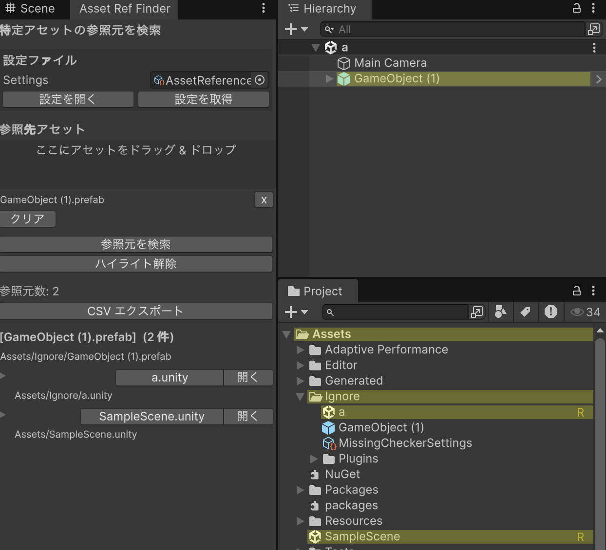
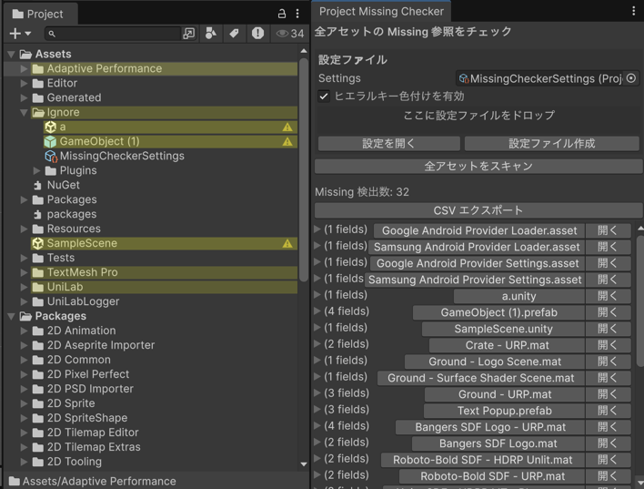
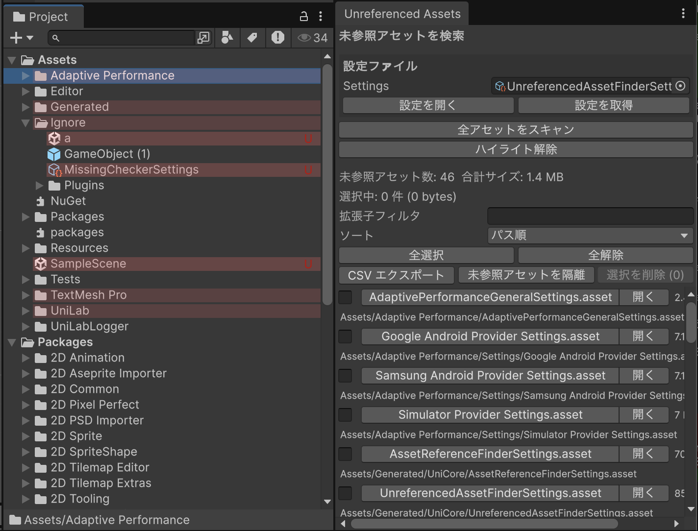
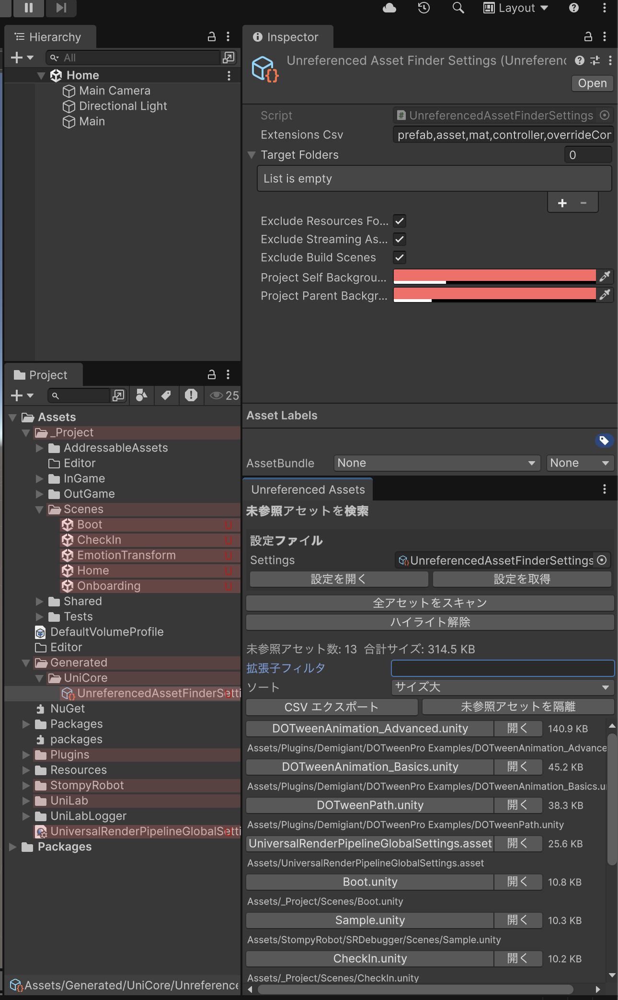
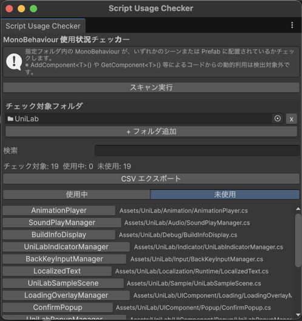
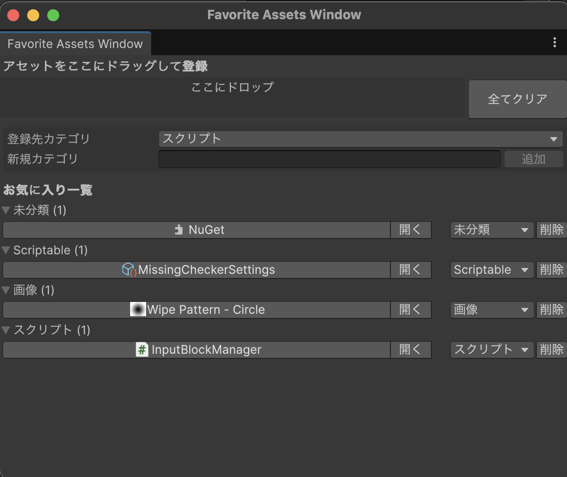

# UniLab/Tools 使い方ガイド

Unity エディタ上でプロジェクト品質管理・ワークフロー効率化を行うエディタツール群。

---

## メニュー構成

```
UniLab/
├── Language Setting/
│   ├── Japanese
│   └── English
├── Tools/
│   ├── Build Check/
│   │   ├── iOS
│   │   └── Android
│   ├── Asset Favorite/
│   │   └── Open Window
│   ├── Open Folder/
│   │   ├── Open PlayerPrefs
│   │   └── PersistentDataPath
│   ├── Missing Checker/
│   │   ├── Open Window
│   │   └── Settings
│   ├── Asset Reference Finder/
│   │   ├── Open Window
│   │   └── Settings
│   ├── Unreferenced Asset Finder/
│   │   ├── Open Window
│   │   └── Settings
│   ├── Script Usage Checker/
│   │   └── Open Window
│   └── Hierarchy Favorite/
│       └── Open Window
└── Clear All Highlights

右クリックメニュー:
  Assets > UniLab > Find References In Project
  GameObject > UniLab > Add to Favorites
```

---

## 各ツール詳細

### 1. Build Checker

**メニュー**: `UniLab/Tools/Build Check/iOS` or `Android`

プラットフォーム別のビルド検証をワンクリックで実行する。実際にデプロイせず、ビルドエラーの有無だけを確認する。成功/失敗をコンソールに出力する。

---

### 2. Asset Reference Finder（アセット参照検索）

**メニュー**: `UniLab/Tools/Asset Reference Finder/Open Window`
**右クリック**: `Assets > UniLab > Find References In Project`

選択したアセットを**参照している側**を逆引き検索する。



#### 使い方

1. ウィンドウ上部の「ここにアセットをドラッグ＆ドロップ」エリアに調べたいアセットを投入する（最大20個）
2. 「参照元を検索」ボタンを押すと、プロジェクト全体をスキャンして参照元を一覧表示する
3. 結果には参照元のアセットパスと参照数が表示される。フォルダアウトを展開すると参照ツリーを深度2まで辿れる
4. 検索後、Project ウィンドウ上で参照元アセットが**黄色背景 + "R" マーカー**でハイライトされる

#### ポイント

- 右クリック `Assets > UniLab > Find References In Project` で選択中のアセットを即検索できる
- 「ハイライト解除」ボタンまたは `UniLab/Clear All Highlights` でハイライトをクリアする
- CSV エクスポートで結果を外部ツールに渡せる

**Settings**: 検索対象フォルダ、対象拡張子（prefab, asset, mat, controller 等）、ハイライト色を設定可能

---

### 3. Missing Checker（Missing 参照チェッカー）

**メニュー**: `UniLab/Tools/Missing Checker/Open Window`

プロジェクト全体の壊れた参照（Missing Reference）を一括検出する。



#### 使い方

1. 「設定ファイル」欄に Settings アセットを指定する（初回は自動生成される）
2. 「全アセットをスキャン」ボタンを押すと、指定フォルダ内の全アセットを走査する
3. 結果一覧には Missing のあるアセットがパスとともに表示される。各行の括弧内（例: `4 fields`）は Missing フィールド数を示す
4. フォルダアウトを展開すると `{ComponentType}.{PropertyPath}` 形式でどのフィールドが壊れているか確認できる

#### ポイント

- Missing Script（null コンポーネント）も検出する
- スキャン後、Hierarchy ウィンドウで Missing のある GameObject が**黄色 + ⚠ マーカー**でハイライトされる
- Project ウィンドウでも該当アセットと親フォルダがハイライトされ、問題箇所が一目でわかる
- CSV エクスポートで CI やレビューに活用できる

**Settings**: 検索フォルダ、拡張子フィルタ、Hierarchy/Project のハイライト色

---

### 4. Unreferenced Asset Finder（未使用アセット検索）

**メニュー**: `UniLab/Tools/Unreferenced Asset Finder/Open Window`

どこからも参照されていないアセットを検出する。





#### 使い方

1. 「設定ファイル」欄に Settings アセットを指定する
2. 「全アセットをスキャン」ボタンを押すと未参照アセットを検出する
3. 結果一覧にはアセットパスとファイルサイズが表示される。ヘッダ部分に合計件数・合計サイズが出る
4. 結果はパス順 / サイズ順 / 拡張子順でソート可能
5. チェックボックスで選択し、「選択アセットを削除」で一括削除、または「隔離フォルダ」に移動して安全に退避できる

#### ポイント

- Settings の Inspector で除外設定を細かく制御できる:
  - **Extensions Csv**: 検索対象の拡張子（prefab, asset, mat, controller 等）
  - **Exclude Resources Folders**: Resources フォルダを除外
  - **Exclude Streaming Assets**: StreamingAssets を除外
  - **Exclude Build Scenes**: ビルド対象シーンを除外
  - **Target Folders**: 検索対象フォルダの指定
- Project ウィンドウ上で未参照アセットが**赤色背景**でハイライトされる
- CSV エクスポートで一覧を保存できる

**Settings**: 検索フォルダ、拡張子フィルタ、除外設定、ハイライト色

---

### 5. Script Usage Checker（スクリプト使用状況チェッカー）

**メニュー**: `UniLab/Tools/Script Usage Checker/Open Window`

MonoBehaviour スクリプトがシーン・Prefab で使われているかを分析する。



#### 使い方

1. 「チェック対象フォルダ」の「+ フォルダ追加」ボタンで、調べたいスクリプトが含まれるフォルダを指定する
2. 「スキャン実行」ボタンを押すと、全シーン・全 Prefab を走査してスクリプトの利用状況を調べる
3. 結果は「使用中」「未使用」の2タブで表示される。ヘッダに検出数・使用中数・未使用数のサマリが出る
4. 各スクリプト行を展開すると、使用箇所のシーンパスや Prefab パスが確認できる

#### ポイント

- Editor フォルダ内のスクリプト・abstract クラス・ジェネリクスクラスは自動でスキップされる
- `AddComponent<T>()` や `GetComponent<T>()` による動的利用は検出しない（静的配置のみ）
- CSV エクスポートで未使用スクリプトのリストを出力し、コードの棚卸しに活用できる

---

### 6. Asset Favorite（アセットお気に入り）

**メニュー**: `UniLab/Tools/Asset Favorite/Open Window`

よく使うアセットをカテゴリ別に登録して素早くアクセスする。



#### 使い方

1. ウィンドウ上部の「ここにドロップ」エリアに、登録したいアセットを Project ウィンドウからドラッグ&ドロップする
2. 「登録先カテゴリ」ドロップダウンで、アセットを登録するカテゴリを選択する
3. 「新規カテゴリ」欄にカテゴリ名を入力し「追加」ボタンで独自のカテゴリを作成できる
4. お気に入り一覧にはカテゴリごとにフォルダアウトで表示される。アセット名をクリックすると Project で選択、「開く」で直接開く

#### ポイント

- 各アセットの右側ドロップダウンでカテゴリを後から変更できる
- 「削除」ボタンで個別削除、「全てクリア」で全件削除
- スクリーンショットの例では「未分類」「Scriptable」「画像」「スクリプト」の4カテゴリに整理されている
- JSON で永続化されるため、Unity を再起動しても保持される

---

### 7. Hierarchy Favorite（ヒエラルキーお気に入り）

**メニュー**: `UniLab/Tools/Hierarchy Favorite/Open Window`
**右クリック**: `GameObject > UniLab > Add to Favorites`

ヒエラルキー上の GameObject をブックマークする。

#### 使い方

1. Hierarchy で GameObject を右クリック → `UniLab > Add to Favorites` で登録する
2. ウィンドウにはシーン別にグルーピングされた一覧が表示される
3. 各エントリにはメモ欄があり、自由にコメントを付けられる
4. エントリをクリックすると対象の GameObject を Hierarchy 上で選択・ハイライトする

#### ポイント

- GlobalObjectId でシリアライズされるため、シーンの保存/リロードに耐える
- 削除済み・未ロードの GameObject は "Missing" 表示になる
- **シーンが保存済みであること**が登録の前提条件

---

### 8. Open Folder（フォルダを開く）

**メニュー**: `UniLab/Tools/Open Folder/`

- **Open PlayerPrefs**: OS 固有の PlayerPrefs 保存先を Finder/Explorer で開く（macOS: `~/Library/Preferences`）
- **PersistentDataPath**: `Application.persistentDataPath` を Finder/Explorer で開く

---

### 9. Clear All Highlights（ハイライト一括クリア）

**メニュー**: `UniLab/Clear All Highlights`

Asset Reference Finder / Missing Checker / Unreferenced Asset Finder の全ハイライトを一括解除する。各ツール個別の「ハイライト解除」ボタンと同じ効果をまとめて実行する。

---

## 言語切り替え

**メニュー**: `UniLab/Language Setting/Japanese` or `English`

全ツールの UI ラベルを日本語/英語に切り替える。EditorPrefs に保存されるため次回起動時も維持される。

---

## 設定ファイル

| 種別 | 保存先 |
|---|---|
| Missing Checker Settings | `Assets/Generated/UniCore/MissingCheckerSettings.asset` |
| Asset Reference Finder Settings | `Assets/Generated/UniCore/AssetReferenceFinderSettings.asset` |
| Unreferenced Asset Finder Settings | `Assets/Generated/UniCore/UnreferencedAssetFinderSettings.asset` |
| Asset Favorite データ | `persistentDataPath/UniLab/Editor/FavoriteAssetsWindow.json` |
| Hierarchy Favorite データ | `persistentDataPath/UniLab/Editor/HierarchyFavorite.json` |
| 言語設定 | EditorPrefs `UniLab.EditorToolLabels.Language` |

---

## Codex / Claude Code との連携

これらのツールは Codex / Claude Code から直接実行することはできない（Editor GUI 操作が必要）。ただし以下の活用が可能:

- **ビルドチェック結果の解析**: コンソールログを貼り付けて原因分析を依頼
- **Missing Reference の修正**: Missing Checker の出力（パス + フィールド名）を共有し、修正コードを生成
- **未使用アセットの整理**: CSV エクスポート結果を共有し、削除対象の判断を支援
- **スクリプト使用状況の確認**: Grep / Glob で動的利用パターンを補完調査
