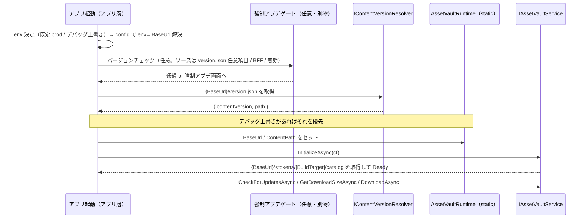

# UniLab.AssetVault CDN 配信設計（URL 規約・バージョニング・配置）
作成日: 2026-06-13

> 配信基盤本体は [design-unilab-asset-vault.md](design-unilab-asset-vault.md)、全体方針は [design-unilab-foundation-overview.md](design-unilab-foundation-overview.md)、利用方法は [asset-vault-guide.md](asset-vault-guide.md) を参照。

本書は `UniLab.AssetVault` が読みにいくアセットを **自前 CDN（S3 + CloudFront）にどう配置し、どの URL で配信するか**を定める。

---

## 前提：RemoteLoadPath は実行時に動かせる

Addressables の `RemoteLoadPath` は「ビルド時に焼かれて固定」ではない。**焼かれるのは Profile 文字列のリテラル部分だけ**で、その中に実行時解決される要素を仕込める。本設計はこれを使い、**アプリのバージョンとアセットのバージョンを分離**する。

| 手段 | 解決タイミング | 用途 |
|---|---|---|
| `[BuildTarget]` トークン | ビルド時 | iOS / Android / StandaloneOSX のプラットフォーム別フォルダ |
| `{Type.StaticMember}` トークン | **実行時**（`AddressablesRuntimeProperties.EvaluateString`） | コンテンツ版・環境の差し替え。`InitializeAsync` の前に静的プロパティをセットする |
| `Addressables.InternalIdTransformFunc` | 実行時（全ロード） | URL の任意書き換え（署名付き URL 等。最終手段） |
| `Addressables.WebRequestOverride` | 実行時（送信直前） | 認証ヘッダ付与・リクエスト改変 |

---

## CDN URL 規約

環境（dev/staging/prod）は**パスの一区切りではなく、ホストごと変わる**運用が一般的（`https://dev1.xxx.xxx/app/` ⇄ `https://cdn.xxx.xxx/app/`）。そこで**環境はホスト込みの base URL（`BaseUrl`）として表し**、版だけをパスセグメントにする。

```
{BaseUrl}/version.json                       ← 固定名・可変・短TTL（版の入口）
{BaseUrl}/<token>/[BuildTarget]/
        ├── catalog_<id>.json     ← コンテンツカタログ
        ├── catalog_<id>.hash     ← 更新検知用（ランタイムが hash をポーリング）
        └── <group>_<contentHash>.bundle ...
```

| 階層 | 意味 | 性質 |
|---|---|---|
| `BaseUrl` | 環境ごとのホスト込み基底（`https://dev1.xxx.xxx/app` 等） | 実行時トークン。env → URL のマッピングは**アプリ config が持つ**（AssetVault はホストを知らない） |
| `version.json` | アクティブなコンテンツ版を指す可変ファイル | **固定名**。アプリが事前知識なしで最初に取得 |
| `<token>` | コンテンツ版の**公開パスセグメント** | **不透明トークン**（ULID 等）。推測不能 |
| `[BuildTarget]` | プラットフォーム | ビルド時トークンで自動展開 |

アプリに焼く RemoteLoadPath（“形”だけ。可変部は実行時トークン）:

```
{UniLab.AssetVault.AssetVaultRuntime.BaseUrl}/{UniLab.AssetVault.AssetVaultRuntime.ContentPath}/[BuildTarget]
```

- `BaseUrl` をホスト込みにしたことで、**サブドメイン違い・別 CDN・別パス・ポート違い**まで吸収できる。「同一ホスト内で env を分けたい」場合は BaseUrl の中に `/<env>/` を含めればよく、設計を狭めない
- URL の可変部（host/env と版）はすべて `AssetVaultRuntime`（コード）に集約。Profile に固定で残るのは `[BuildTarget]` だけ（プラットフォーム解決は Addressables に任せ、手動マッピングしない）

---

## 配置 URL と 読み込み URL の決定

「どこに置くか（配置）」と「どこから読むか（読み込み）」は別工程で、最終的に**同じ URL を指す**必要がある。両者を同期させるのが `version.json` と `BaseUrl` である。

### A. 配置 URL（ビルド → アップロード）

1. **Addressables ビルド**：`RemoteBuildPath`（例 `ServerData/[BuildTarget]/`）に catalog と bundle を出力。**bundle のファイル名はここで確定**（コンテンツハッシュ付き、Addressables が決める）
2. **CDN へアップロード（運用/CI が決める）**：
   - catalog + bundle → `{BaseUrl}/<token>/[BuildTarget]/`
   - `version.json` → `{BaseUrl}/version.json`（「どの版か」を読み込み側へ伝える入口）

| 部品 | 決める人 |
|---|---|
| `BaseUrl`（ホスト＝env） | 運用（env ごとのホスト） |
| 版フォルダ名（`<token>`） | リリース運用（不透明トークン。新版ごとに新フォルダ） |
| `[BuildTarget]` / bundle 名 | Addressables（ビルドが自動生成） |

### B. 読み込み URL（ランタイム）

**2系統に分かれる。**

- **(1) 版チェック URL ＝ コードが組む**
  ```
  {BaseUrl}/version.json
  ```
  - `BaseUrl` は env からアプリ config で解決。**`[BuildTarget]` は付かない**（版はプラットフォーム共通）。`ContentPath` もまだ無い
  - Addressables のトークンとは無関係。`InitializeAsync` の前に素の `UnityWebRequest` で取得する
  - 結果 `{ contentVersion, path }` を得る

- **(2) catalog/bundle URL ＝ Addressables が組む**
  ```
  {BaseUrl}/{ContentPath}/[BuildTarget]/<bundleファイル名>
  ```
  - `BaseUrl` / `ContentPath` = コードが `AssetVaultRuntime` にセット（`ContentPath` = version.json の `path`）
  - `[BuildTarget]` = Addressables 自動、`<bundleファイル名>` = catalog から解決（アドレス→bundle）

### C. 配置 = 読み込み が一致する条件（肝）

読み込み URL は配置 URL と**完全一致**しないと 404 になる。一致の担保：

| 要素 | 配置（アップロード） | 読み込み（ランタイム） | 一致のさせ方 |
|---|---|---|---|
| ホスト | アップロード先ホスト | アプリ config の `BaseUrl` | env ごとに両者を揃える |
| 版フォルダ | アップした `<token>` | `version.json` の `path` | **version.json が橋渡し** |
| プラットフォーム/ファイル名 | Addressables ビルド出力 | Addressables が catalog から解決 | Addressables が両側同一規則 |

### D. 具体例（env=dev1 / iOS / 版 01J9…）

```
配置（CI）:
  build  → ServerData/iOS/ に catalog+bundle
  upload → https://dev1.xxx.xxx/app/01J9Z8K3Q4XR/iOS/
  update → https://dev1.xxx.xxx/app/version.json = { path:"01J9Z8K3Q4XR" }

読み込み（アプリ）:
  config: dev1 → BaseUrl=https://dev1.xxx.xxx/app
  GET    https://dev1.xxx.xxx/app/version.json → path=01J9Z8K3Q4XR
  set    AssetVaultRuntime.BaseUrl / ContentPath
  Addressables → https://dev1.xxx.xxx/app/01J9Z8K3Q4XR/iOS/catalog_*.json + *.bundle
```

---

## version.json 仕様

```json
{
  "contentVersion": "00052",
  "path": "01J9Z8K3Q4XR"
}
```

取得 URL は `{BaseUrl}/version.json`（プラットフォーム非依存のため `[BuildTarget]` を付けない）。`IContentVersionResolver` がコードで組み立てる。

| フィールド | 用途 | 比較方法 |
|---|---|---|
| `contentVersion` | 内部版 ID（ログ・表示・変更検知）。人間がソートできる連番/タイムスタンプ | **文字列一致**（順序比較しない） |
| `path` | 公開 URL の不透明セグメント。実 URL の構築に使う | 文字列としてそのまま使用 |

- **文字列一致で「違えば版違い」**。順序（大小）は見ない。これにより版の形式が自由になり、かつ**ロールバック（旧版へ戻す）が自然に動く**（「より大きい版のみ採用」だとロールバックが弾かれるため不可）
- 順序比較が要るのは**強制アプデのアプリ版判定だけ**（後述）。コンテンツ版とは別概念
- `version.json` は**短TTL＋デプロイ毎に CloudFront 無効化**（更新検知の要）

---

## 起動時の解決フロー



1. **env を決定**（既定 prod / デバッグ上書き）→ アプリ config で **env→BaseUrl** を解決
2. （任意）強制アプデゲートを通す
3. `{BaseUrl}/version.json` を取得し `contentVersion` / `path` を得る
4. コンテンツ版を決定（**デバッグ上書き ＞ version.json** の優先度）
5. `AssetVaultRuntime.BaseUrl` / `ContentPath` をセット
6. `InitializeAsync` → 解決済み URL のカタログを読む。以降は既存の差分DLフロー

---

## アプリ版とアセット版の分離方針

- **互換の床は設けない**。コンテンツ版とアプリ版は普段は完全独立で運用する
- 互換が切れる更新（新コード/シェーダー依存のコンテンツ等）を出すときは、**アプリの強制アップデート**で対応する
- 強制アプデは **AssetVault の関心事ではない**。独立した別ゲートとして実装し、判定ソースは差し替え可能にする:

| 強制アプデの判定ソース | 使う場面 |
|---|---|
| `version.json` の任意フィールド（例 `minRequiredAppVersion`） | CDN だけで完結させたいとき |
| BFF / Remote Config | サーバで集中管理したいとき |
| 使わない | 強制アプデ不要な構成 |

- 判定に使うアプリ版比較のみ**順序/semver 比較**（`app < min なら強制`）。コンテンツ版の文字列一致とは別物

---

## デバッグでの呼び先変更（版違い・別環境のロード）

`AssetVaultRuntime.BaseUrl` / `ContentPath` は単なる静的プロパティで、解決ロジックが **「デバッグ上書き ＞ version.json」** の優先度を持つ。`InitializeAsync` の前にこれらを上書きすれば、**version.json が指す版とは別の版・別環境を読み込める**（QA で特定版を狙ってテストする等）。

- **同一ホストの版違い** → `ContentPath` だけ上書き（例：旧版 `00050` や未公開の事前ステージ版を指定）
- **別環境の版** → `BaseUrl` ＋ `ContentPath` を上書き（prod アプリで dev1/staging のアセットを見る）。既存 `AssetVaultProfileSwitcher` / `EnvironmentConfig`（UniLab.Debug）と連動
- **完全に任意 URL** → `Addressables.InternalIdTransformFunc` で書き換え（最終手段）

### 成立条件

1. **`InitializeAsync` の前にセットする**。カタログ URL がトークンを使うため、初期化後の書き換えはロード済みカタログに反映されない。デバッグ上書きは「version.json 解決をスキップして直接セット」の形にする
2. **対象版が CDN に存在する**こと（アップ済みなら旧版・未公開版でも可）
3. **互換性は別問題**：対象版のコンテンツが今のアプリに無いコード/シェーダーに依存していると、ロード時に失敗し得る（＝版違いの本質的制約。純データ版なら問題なし）

---

## アセットの配置（フォルダ規約・グループ・パッキング・ラベル）

### 同期対象フォルダ（分類の真実）

分類は固定フォルダ規約ではなく、設定アセット `AssetVaultSetupSettings` の **Local フォルダ（必須）** と **Remote フォルダ（任意）** の2スロットで定義する。各スロットが配信先を決め（フォルダ名は無関係）、各フォルダ直下のサブフォルダがグループ単位を決める。

```
（フォルダ位置・名前はプロジェクト任意）
Local Folder  (必須) → サブフォルダ Sub → グループ Local_<Sub>
Remote Folder (任意) → サブフォルダ Sub → グループ Remote_<Sub>
```

| 配信先 | スロット | グループ | 変更可否 | バンドル出力 |
|---|---|---|---|---|
| **Local（同梱）** | Local Folder（必須） | `Local_<Sub>` | Cannot Change（StaticContent=true） | アプリ同梱（StreamingAssets へ**自動・不可視**出力） |
| **Remote（CDN）** | Remote Folder（任意） | `Remote_<Sub>` | Can Change（StaticContent=false） | CDN（`ServerData/`→アップロード） |

- **ソースのフォルダ位置は自由**（Addressables は GUID 参照）。各フォルダ直下のサブフォルダ構成は任意。直置きはルートフォルダ名から作る既定グループ（`Local_<FolderName>` / `Remote_<FolderName>`）
- **StreamingAssets はソースの置き場ではない**。Local バンドルのビルド成果物が自動的に入るだけで、開発者は意識しない
- 両配信先とも `IAssetScope.LoadAssetAsync` で透過的にロード（アプリコードは Local/Remote を意識しない）。実行時トークン（BaseUrl/ContentPath）は **Remote だけ**に効く
- アドレス（ランタイムキー）= **ルートフォルダ相対パス・拡張子なし**（`Assets/.../Remote/Characters/hero.prefab` → `Characters/hero`）。Local/Remote 間で同一相対パスがあると衝突するため、セットアップ時に重複アドレスを警告する
- 配信先はフォルダ名ではなくスロット（Local/Remote）で決まる。Local は必須、Remote は未設定可（その場合 Remote 同期はスキップ）

### セットアップ自動化（エディタメニュー）

`UniLab.AssetVault.Editor` に以下を用意。手作業の Profile/グループ設定を排除する。

| メニュー | 役割 |
|---|---|
| `UniLab/AssetVault/Setup/Open Setup Settings` | `AssetVaultSetupSettings`（Local/Remote フォルダ指定の ScriptableObject）を Inspector で開く。**Sync AssetResource ボタンはこの Inspector 内**にあり、入口を1か所に集約している |

Sync AssetResource の処理（冪等）: Profile 変数（`RemoteLoadPath`=実行時トークン定数 / `RemoteBuildPath`=`ServerData/[BuildTarget]`）設定、Local(必須)/Remote(任意)フォルダ走査、サブフォルダ→グループ生成、アセットを `CreateOrMoveEntry` で登録、schema（Build/Load Path・AppendHash・StaticContent）設定、重複アドレス警告。

- RemoteLoadPath のトークンは `typeof(AssetVaultRuntime).FullName` から組み立て（リネーム耐性）
- **env は実行時 BaseUrl で切替 → Addressables Profile は1つでよい**

**バンドルのパッキング**

- 独立にロードする資産 → **Pack Separately**（過剰DL防止）
- まとめて事前DLする資産 → **Pack Together by Label**（DL単位＝1バンドル群）
- **Append Hash to Filename: ON**（コンテンツハッシュ名）。差分DLとキャッシュの前提

**ラベル＝ダウンロード単位**（`AssetVault.DownloadAsync(labels)`）

- `preload`（初回必須）/ `stage01` / `event_xmas` のようにライフサイクルで付与
- `GetDownloadSizeAsync(labels)` で要否判定 → `DownloadAsync(labels)` で取得

**アドレス（＝ランタイムキー）規約**

- `category/name` に統一（`characters/hero` / `ui/popup/reward`）。**安定させる**（変更すると参照が壊れる）

---

## アセットだけ更新する2パターン

いずれもアプリ更新不要。

| パターン | 操作 | クライアント挙動 |
|---|---|---|
| 同一版内のマイナー差分 | 現 `<token>` フォルダに Content Update ビルドを追加（`content_state.bin` 基準） | `catalog.hash` ポーリングで検知 → 変更バンドルのみ再DL |
| 版世代の切替 | 新 `<token>` フォルダを作りアップ → `version.json` を書き換え | 次回起動で `contentVersion` の文字列不一致を検知 → 新版へ |

**ロールバック**: `version.json` を旧 `path` に書き換えるだけ（旧版フォルダは残す）。バンドルはコンテンツハッシュ名で共存しているため即時復帰できる。

---

## S3 + CloudFront キャッシュ設計

| 対象 | 性質 | Cache-Control / 運用 |
|---|---|---|
| `<group>_<hash>.bundle` | 不変（コンテンツハッシュ名） | `public, max-age=31536000, immutable`。CloudFront で永久キャッシュ |
| `catalog_*.json` / `catalog_*.hash` | 可変 | 短TTL（または `max-age=0`）＋デプロイ毎に **Invalidation** |
| `version.json` | 可変・最頻更新 | 短TTL ＋ **Invalidation**。ここが古いと更新検知できない |

- アップロード順は **バンドル → カタログ → version.json**（参照先が揃ってから入口を更新）
- **S3 のディレクトリ一覧（ListBucket）は無効化**。未公開版の列挙を防ぐ

---

## セキュリティ方針

- 公開ゲームの配信アセットは**原理的に公開物**。現行リリース版は `version.json` から辿れて当然であり、隠す対象ではない
- 守るべきは**未公開・事前ステージ済みの版**（次イベント等のデータマイニング防止）。これは以下で担保:
  - 公開パスの `<token>` を**推測不能な不透明トークン**にする（連番は次版を推測されるため不可）
  - 未公開版は **`version.json` に載せない**（載った瞬間に初めて公開）
  - **ディレクトリ一覧を無効化**
  - バンドル名はコンテンツハッシュで不可推測（カタログを取られない限り辿れない）
- 署名付き URL / 署名 Cookie は「時間制限・ホットリンク防止」用。公開アセットの秘匿には過剰で、署名鍵もアプリから抽出され得るため真の秘匿にはならない（必要なら `WebRequestOverride` / `InternalIdTransformFunc` で実装）

---

## AssetVault への追加（最小）

| 追加 | 種別 | 責務 |
|---|---|---|
| `AssetVaultRuntime` | runtime（static） | `static string BaseUrl`（ホスト込み基底）/ `static string ContentPath`（版セグメント）。`InitializeAsync` 前にアプリ層がセット。RemoteLoadPath の実行時トークンが参照 |
| `IContentVersionResolver` | runtime（抽象） | 解決済み `BaseUrl` 配下の `version.json` を取得して版を返す。実装はアプリ層 / BFF。デバッグ上書きの優先度もここで解決 |
| `RemoteContentVersionResolver` | runtime（既定実装） | `{BaseUrl}/version.json` を `UnityWebRequest`（タイムアウト付き）で取得・パース。取得処理は注入可能でテスタブル |
| `AssetVaultSetupSettings` / `AssetVaultSetupMenu` | editor | フォルダ規約から Addressables を自動構成（上記「セットアップ自動化」）。ルートパスは設定で変更可 |

- 既存の `IAssetVaultService` / 状態機械 / 差分DL / `IAssetScope` は**不変**。起動シーケンスに「env→BaseUrl 解決 → version.json 解決 → 静的プロパティ設定 → Init」を足すだけ
- env → `BaseUrl` のマッピングは**アプリ config** が持つ（AssetVault はホストを知らない）
- 強制アプデゲートは AssetVault に含めない（アプリ層）

---

## 未決事項（実装前に決める）

| 項目 | 選択肢 | 備考 |
|---|---|---|
| `version.json` のホストと更新権限 | CloudFront 配下の S3 / BFF | 短TTL＋Invalidation 前提 |
| 不透明トークンの生成方式 | ULID / ランダム hex / カタログのコンテンツハッシュ | 推測不能であればよい。内部版 ID は別途連番で保持 |
| 強制アプデの判定ソース | `version.json` 任意項目 / BFF / 無効 | AssetVault 非依存。アプリ層で実装 |
| 署名付き URL の要否 | 不要（公開バケット）/ 必要 | 公開アセットなら通常不要 |

---

> **言語バージョン制約**: 本プロジェクトは Unity 6000.5（**C# 9** まで）。`record` / `record struct` は C# 10 機能のため使用不可。値型は `readonly struct` で実装する（等価比較が必要な場合のみ `IEquatable<T>` を手実装）。
