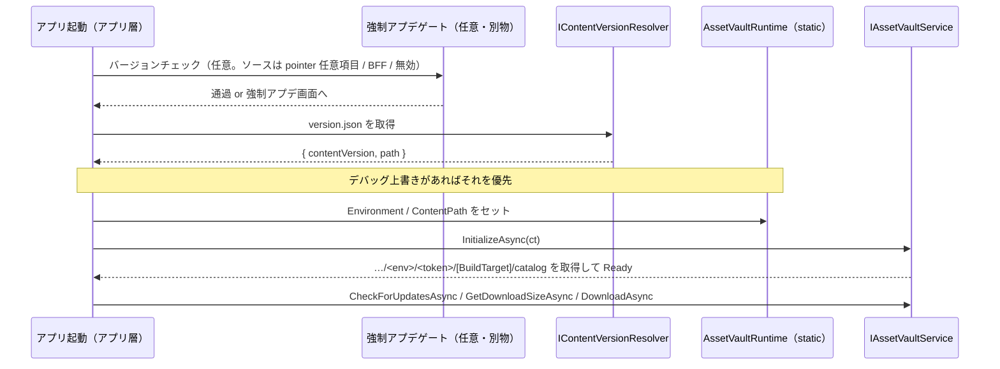

# UniLab.AssetVault CDN 配信設計（URL 規約・バージョニング・配置）
作成日: 2026-06-13

> 配信基盤本体は [design-unilab-asset-vault.md](design-unilab-asset-vault.md)、全体方針は [design-unilab-foundation-overview.md](design-unilab-foundation-overview.md)、利用方法は [asset-vault-guide.md](asset-vault-guide.md) を参照。

本書は `UniLab.AssetVault` が読みにいくアセットを **自前 CDN（S3 + CloudFront）にどう配置し、どの URL で配信するか**を定める。

---

## 前提：RemoteLoadPath は実行時に動かせる

Addressables の `RemoteLoadPath` は「ビルド時に焼かれて固定」ではない。**焼かれるのは Profile 文字列のリテラル部分だけ**で、その中に実行時解決される要素を仕込める。本設計はこれを使い、**アプリのバージョンとアセットのバージョンを分離**する。

| 手段 | 解決タイミング | 用途 |
|---|---|---|
| `[BuildTarget]` トークン | ビルド時 | iOS / Android / StandaloneOSX のプラットフォーム別フォルダ |
| `{Type.StaticMember}` トークン | **実行時**（`AddressablesRuntimeProperties.EvaluateString`） | コンテンツ版・環境の差し替え。`InitializeAsync` の前に静的プロパティをセットする |
| `Addressables.InternalIdTransformFunc` | 実行時（全ロード） | URL の任意書き換え（署名付き URL 等。最終手段） |
| `Addressables.WebRequestOverride` | 実行時（送信直前） | 認証ヘッダ付与・リクエスト改変 |

---

## CDN URL 規約

基点を `https://<cdn-host>/app/` とした場合の配置:

```
https://<cdn-host>/app/<env>/version.json              ← 固定名・可変・短TTL（唯一の入口）
https://<cdn-host>/app/<env>/<token>/[BuildTarget]/
        ├── catalog_<id>.json     ← コンテンツカタログ
        ├── catalog_<id>.hash     ← 更新検知用（ランタイムが hash をポーリング）
        └── <group>_<contentHash>.bundle ...
```

| 階層 | 意味 | 性質 |
|---|---|---|
| `<env>` | dev / staging / prod | 実行時トークン（既定 prod、デバッグで上書き可） |
| `version.json` | アクティブなコンテンツ版を指す可変ファイル | **固定名**。アプリが事前知識なしで最初に取得 |
| `<token>` | コンテンツ版の**公開パスセグメント** | **不透明トークン**（ULID 等）。推測不能 |
| `[BuildTarget]` | プラットフォーム | ビルド時トークンで自動展開 |

アプリに焼く RemoteLoadPath（“形”だけ。版・環境は実行時トークン）:

```
https://<cdn-host>/app/{UniLab.AssetVault.AssetVaultRuntime.Environment}/{UniLab.AssetVault.AssetVaultRuntime.ContentPath}/[BuildTarget]
```

---

## version.json 仕様

```json
{
  "contentVersion": "00052",
  "path": "01J9Z8K3Q4XR"
}
```

| フィールド | 用途 | 比較方法 |
|---|---|---|
| `contentVersion` | 内部版 ID（ログ・表示・変更検知）。人間がソートできる連番/タイムスタンプ | **文字列一致**（順序比較しない） |
| `path` | 公開 URL の不透明セグメント。実 URL の構築に使う | 文字列としてそのまま使用 |

- **文字列一致で「違えば版違い」**。順序（大小）は見ない。これにより版の形式が自由になり、かつ**ロールバック（旧版へ戻す）が自然に動く**（「より大きい版のみ採用」だとロールバックが弾かれるため不可）
- 順序比較が要るのは**強制アプデのアプリ版判定だけ**（後述）。コンテンツ版とは別概念
- `version.json` は**短TTL＋デプロイ毎に CloudFront 無効化**（更新検知の要）

---

## 起動時の解決フロー



1. （任意）強制アプデゲートを通す
2. `version.json` を取得し `contentVersion` / `path` を得る
3. コンテンツ版を決定（**デバッグ上書き ＞ version.json** の優先度）
4. `AssetVaultRuntime.Environment` / `ContentPath` をセット
5. `InitializeAsync` → 解決済み URL のカタログを読む。以降は既存の差分DLフロー

---

## アプリ版とアセット版の分離方針

- **互換の床は設けない**。コンテンツ版とアプリ版は普段は完全独立で運用する
- 互換が切れる更新（新コード/シェーダー依存のコンテンツ等）を出すときは、**アプリの強制アップデート**で対応する
- 強制アプデは **AssetVault の関心事ではない**。独立した別ゲートとして実装し、判定ソースは差し替え可能にする:

| 強制アプデの判定ソース | 使う場面 |
|---|---|
| `version.json` の任意フィールド（例 `minRequiredAppVersion`） | CDN だけで完結させたいとき |
| BFF / Remote Config | サーバで集中管理したいとき |
| 使わない | 強制アプデ不要な構成 |

- 判定に使うアプリ版比較のみ**順序/semver 比較**（`app < min なら強制`）。コンテンツ版の文字列一致とは別物

---

## デバッグでの呼び先変更

`AssetVaultRuntime.Environment` / `ContentPath` は単なる静的プロパティで、解決ロジックが **「デバッグ上書き ＞ version.json」** の優先度を持つ。これにより開発/QA ビルドで:

- 任意の `ContentPath`（非対応版含む）を直接指定して読む
- `Environment` を staging / dev に切替（prod アプリで staging アセットを見る）。既存 `AssetVaultProfileSwitcher` / `EnvironmentConfig`（UniLab.Debug）と連動
- 完全に任意 URL へ向けたい場合のみ `Addressables.InternalIdTransformFunc` で書き換え

---

## アセットの配置（グループ・パッキング・ラベル）

**グループ分割（配信ライフサイクルで分ける）**

| グループ | 変更可否 | 配置 | 例 |
|---|---|---|---|
| `Local_Boot` | Cannot Change Post Release | アプリ同梱（StreamingAssets） | 起動必須の最小限：ブートシーン・共通 UI |
| `Remote_<feature>` | Can Change Post Release | CDN | `Remote_Characters` / `Remote_Stages` / `Remote_UI` / `Remote_Audio` |

**バンドルのパッキング**

- 独立にロードする資産 → **Pack Separately**（過剰DL防止）
- まとめて事前DLする資産 → **Pack Together by Label**（DL単位＝1バンドル群）
- **Append Hash to Filename: ON**（コンテンツハッシュ名）。差分DLとキャッシュの前提

**ラベル＝ダウンロード単位**（`AssetVault.DownloadAsync(labels)`）

- `preload`（初回必須）/ `stage01` / `event_xmas` のようにライフサイクルで付与
- `GetDownloadSizeAsync(labels)` で要否判定 → `DownloadAsync(labels)` で取得

**アドレス（＝ランタイムキー）規約**

- `category/name` に統一（`characters/hero` / `ui/popup/reward`）。**安定させる**（変更すると参照が壊れる）

---

## アセットだけ更新する2パターン

いずれもアプリ更新不要。

| パターン | 操作 | クライアント挙動 |
|---|---|---|
| 同一版内のマイナー差分 | 現 `<token>` フォルダに Content Update ビルドを追加（`content_state.bin` 基準） | `catalog.hash` ポーリングで検知 → 変更バンドルのみ再DL |
| 版世代の切替 | 新 `<token>` フォルダを作りアップ → `version.json` を書き換え | 次回起動で `contentVersion` の文字列不一致を検知 → 新版へ |

**ロールバック**: `version.json` を旧 `path` に書き換えるだけ（旧版フォルダは残す）。バンドルはコンテンツハッシュ名で共存しているため即時復帰できる。

---

## S3 + CloudFront キャッシュ設計

| 対象 | 性質 | Cache-Control / 運用 |
|---|---|---|
| `<group>_<hash>.bundle` | 不変（コンテンツハッシュ名） | `public, max-age=31536000, immutable`。CloudFront で永久キャッシュ |
| `catalog_*.json` / `catalog_*.hash` | 可変 | 短TTL（または `max-age=0`）＋デプロイ毎に **Invalidation** |
| `version.json` | 可変・最頻更新 | 短TTL ＋ **Invalidation**。ここが古いと更新検知できない |

- アップロード順は **バンドル → カタログ → version.json**（参照先が揃ってから入口を更新）
- **S3 のディレクトリ一覧（ListBucket）は無効化**。未公開版の列挙を防ぐ

---

## セキュリティ方針

- 公開ゲームの配信アセットは**原理的に公開物**。現行リリース版は `version.json` から辿れて当然であり、隠す対象ではない
- 守るべきは**未公開・事前ステージ済みの版**（次イベント等のデータマイニング防止）。これは以下で担保:
  - 公開パスの `<token>` を**推測不能な不透明トークン**にする（連番は次版を推測されるため不可）
  - 未公開版は **`version.json` に載せない**（載った瞬間に初めて公開）
  - **ディレクトリ一覧を無効化**
  - バンドル名はコンテンツハッシュで不可推測（カタログを取られない限り辿れない）
- 署名付き URL / 署名 Cookie は「時間制限・ホットリンク防止」用。公開アセットの秘匿には過剰で、署名鍵もアプリから抽出され得るため真の秘匿にはならない（必要なら `WebRequestOverride` / `InternalIdTransformFunc` で実装）

---

## AssetVault への追加（最小）

| 追加 | 種別 | 責務 |
|---|---|---|
| `AssetVaultRuntime` | runtime（static） | `static string Environment` / `static string ContentPath`。`InitializeAsync` 前にアプリ層がセット。RemoteLoadPath の実行時トークンが参照 |
| `IContentVersionResolver` | runtime（抽象） | `version.json` を取得して版を返す。実装はアプリ層 / BFF。デバッグ上書きの優先度もここで解決 |

- 既存の `IAssetVaultService` / 状態機械 / 差分DL / `IAssetScope` は**不変**。起動シーケンスに「版解決 → 静的プロパティ設定 → Init」の1ステップを足すだけ
- 強制アプデゲートは AssetVault に含めない（アプリ層）

---

## 未決事項（実装前に決める）

| 項目 | 選択肢 | 備考 |
|---|---|---|
| `version.json` のホストと更新権限 | CloudFront 配下の S3 / BFF | 短TTL＋Invalidation 前提 |
| 不透明トークンの生成方式 | ULID / ランダム hex / カタログのコンテンツハッシュ | 推測不能であればよい。内部版 ID は別途連番で保持 |
| 強制アプデの判定ソース | `version.json` 任意項目 / BFF / 無効 | AssetVault 非依存。アプリ層で実装 |
| 署名付き URL の要否 | 不要（公開バケット）/ 必要 | 公開アセットなら通常不要 |

---

> **言語バージョン制約**: 本プロジェクトは Unity 6000.4（**C# 9** まで）。`record` / `record struct` は C# 10 機能のため使用不可。値型は `readonly struct` で実装する（等価比較が必要な場合のみ `IEquatable<T>` を手実装）。
