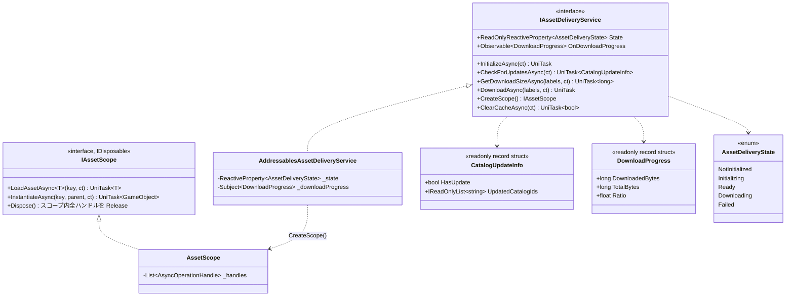
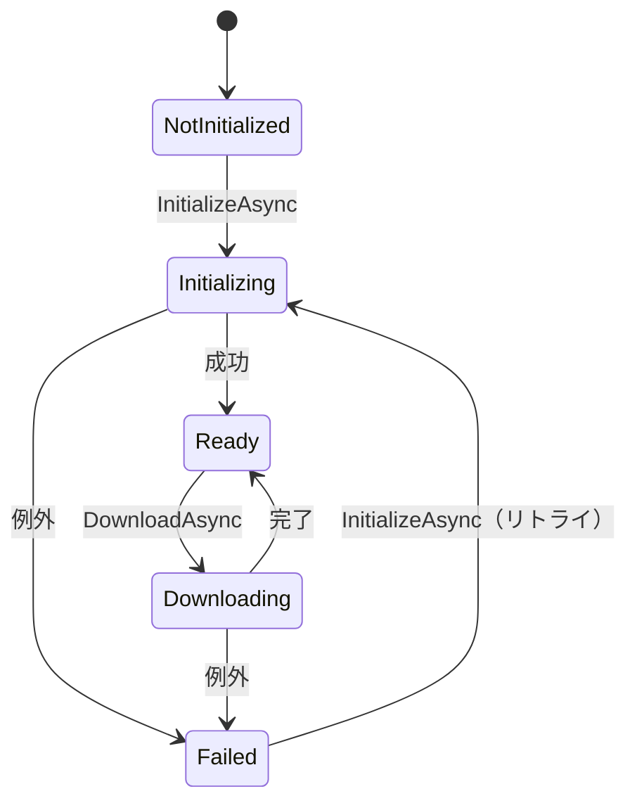
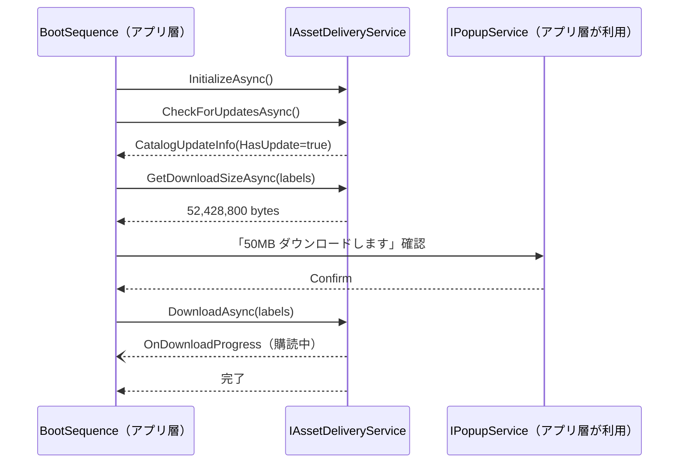

# UniLab.AssetDelivery 設計書（Addressable 配信基盤）
作成日: 2026-06-13

> 全体方針は [design-unilab-foundation-overview.md](design-unilab-foundation-overview.md) を参照。

---

## 概要

Addressables の生 API をアプリ層から完全に隠蔽し、以下を提供する配信基盤。

- リモートカタログの**更新チェック**（差分検知）
- ラベル単位の**差分ダウンロードサイズ取得**と**事前ダウンロード**
- R3 Observable による**進捗・状態通知**
- スコープベースの**ハンドルライフサイクル管理**（Release 漏れの構造的防止）
- キャッシュクリア

アプリ層は `IAssetDeliveryService` のみを参照する。`UnityEngine.AddressableAssets` への using はこのアセンブリの外に一切漏らさない。

---

## 成果物

```
Assets/UniLab/AssetDelivery/
├── UniLab.AssetDelivery.asmdef
├── Interface/
│   ├── IAssetDeliveryService.cs
│   └── IAssetScope.cs
├── Model/
│   ├── CatalogUpdateInfo.cs
│   ├── DownloadProgress.cs
│   └── AssetDeliveryState.cs
├── AddressablesAssetDeliveryService.cs
├── AssetScope.cs
├── AssetDeliveryException.cs
└── Editor/
    ├── UniLab.AssetDelivery.Editor.asmdef
    ├── AssetDeliveryBuildMenu.cs    ← 新規ビルド / 差分ビルド
    └── AssetDeliveryProfileSwitcher.cs ← dev / staging / prod Profile 切り替え
```

---

## クラス図



---

## 公開 API 設計

### IAssetDeliveryService

| メンバー | 誰が呼ぶか / 何が起きるか |
|---|---|
| `State` | アプリ層がローディング UI の出し分けに購読する。状態遷移は下記ステートマシン参照 |
| `OnDownloadProgress` | ダウンロード進捗バーが購読する。`DownloadAsync` 実行中のみ発火 |
| `InitializeAsync` | BootSequence が起動時に1回呼ぶ。`Addressables.InitializeAsync` + カタログロード |
| `CheckForUpdatesAsync` | BootSequence が呼ぶ。`CheckForCatalogUpdates` → 更新があれば `UpdateCatalogs` まで実施し、結果を返す |
| `GetDownloadSizeAsync` | ダウンロード確認ダイアログの表示判定に使う。0 ならダイアログ不要 |
| `DownloadAsync` | ラベル単位の事前ダウンロード。`DownloadDependenciesAsync` のラップ |
| `CreateScope` | 画面/シーン単位でスコープを作る。アセットロードは必ずスコープ経由 |
| `ClearCacheAsync` | デバッグメニュー・容量逼迫時に呼ぶ。`Addressables.CleanBundleCache` のラップ |

### IAssetScope — ハンドル管理の構造的解決

**個別 Release 方式は採用しない。** ロードしたハンドルはスコープが追跡し、`Dispose()` で一括 Release する。画面の LifetimeScope（VContainer）にスコープを紐付ければ、画面破棄＝アセット解放が保証される。

```csharp
// SceneLifetimeScope での登録例（利用側）
builder.Register(resolver =>
        resolver.Resolve<IAssetDeliveryService>().CreateScope(),
    Lifetime.Scoped);
// → Scoped Dispose 時に IAssetScope.Dispose() が呼ばれ全ハンドル解放
```

---

## ステートマシン



---

## 起動フロー（アプリ層との協調）

確認ダイアログ・進捗 UI は**アプリ層の責務**。AssetDelivery は判断材料（サイズ・進捗）を返すだけ。



---

## エラーハンドリング

| 事象 | 表現 |
|---|---|
| カタログ更新なし | `CatalogUpdateInfo.HasUpdate == false`（正常系） |
| ダウンロードサイズ 0 | 戻り値 `0`（正常系） |
| ネットワーク断・カタログ取得失敗 | `AssetDeliveryException`（InnerException に Addressables の例外を保持） |
| キーが存在しない | `AssetDeliveryException`（実装バグ扱い。Result にしない） |

`DownloadAsync` 失敗時は途中までのキャッシュは保持される（Addressables 標準挙動）。リトライは同メソッド再呼び出しで差分から再開される。

---

## 環境切り替え・配信先

- 配信先 URL は Addressables **Profile の RemoteLoadPath** で切り替える（dev / staging / prod）
- ランタイムコードは配信先を知らない。CCD でも Supabase Storage でも本設計は不変
- Profile 切り替えは既存計画の `EnvironmentConfig`（UniLab.Debug）と連動させる。ビルド時に Profile を選択するエディタ拡張を `Editor/` に用意する

## コンテンツ更新運用（Content Update Workflow）

- `Cannot Change Post Release` グループ（ビルトイン相当）と `Can Change Post Release` グループ（配信対象）を分ける
- 差分配信は Addressables 標準の Content Update ビルドを使う。`addressables_content_state.bin` をビルドごとに保管する
- エディタメニュー `UniLab/AssetDelivery/Build` に「新規ビルド」「差分ビルド」を用意する

---

## Observable 方針

`OnDownloadProgress` は内部 Subject から公開し、**OnError を流さない**（OnNext のみ）。例外系はすべて `DownloadAsync` 等の UniTask 側で投げる（R3 規約「ストリームを終了させない」準拠）。

---

## perf 方針

- `DownloadProgress` は `readonly record struct`。進捗通知は毎フレーム発火し得るためボクシング・アロケーションを避ける
- 進捗ポーリングは `PercentComplete` を毎フレーム読むのではなく、`GetDownloadStatus()` の値が変化したときのみ `Subject.OnNext` する
