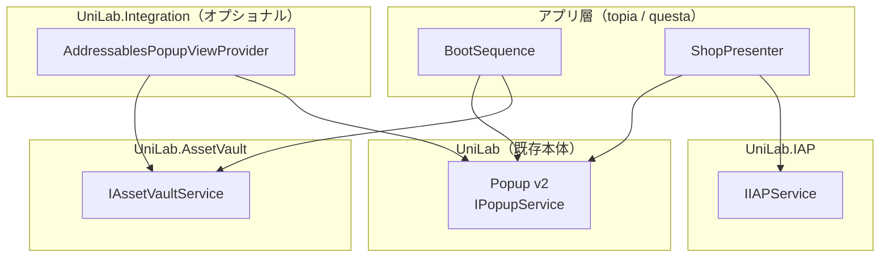

# UniLab 基盤3点セット 全体設計方針
作成日: 2026-06-13

---

## 概要

UniLab に以下の3基盤を追加する。いずれも**プロジェクト非依存・疎結合**を最優先とし、topia / questa 等の複数プロジェクトで使い回す。

| 基盤 | アセンブリ | 設計書 |
|---|---|---|
| Addressable 配信基盤 | `UniLab.AssetVault` | [design-unilab-asset-vault.md](design-unilab-asset-vault.md) |
| UnityIAP 課金基盤 | `UniLab.IAP` | [design-unilab-iap.md](design-unilab-iap.md) |
| ポップアップ基盤 v2 | `UniLab`（既存 Popup の汎用化） | [design-unilab-popup-v2.md](design-unilab-popup-v2.md) |

---

## 疎結合の原則

**3基盤の間に直接の asmdef 参照を一切作らない。** 接続が必要な箇所はすべてインターフェース注入とし、アダプタ実装は `UniLab.Integration`（オプショナルアセンブリ）またはアプリ層に置く。



### 結合が発生しそうな箇所と切り方

| ユースケース | 切り方 |
|---|---|
| ポップアップの View を Addressables からロードしたい | Popup は `IPopupViewProvider` を注入で受ける。Addressables 実装は `UniLab.Integration` に置く |
| 課金完了/失敗をポップアップで通知したい | IAP は結果（`PurchaseResult`）を返すだけで UI を知らない。表示はアプリ層の Presenter が行う |
| ダウンロード確認ダイアログを出したい | AssetVault は必要サイズを返すだけ。確認 UI はアプリ層が組む |
| レシートをサーバ検証したい | IAP は `IReceiptValidator` を注入で受ける。実装（Supabase / ASP.NET Core）はアプリ層 |

---

## asmdef 構成

```
Assets/UniLab/
├── UniLab.asmdef                     ← 既存本体（Popup v2 はここに含む）
├── AssetVault/
│   └── UniLab.AssetVault.asmdef   ← 参照: Logger, R3, UniTask, UniTask.Addressables, Unity.Addressables, Unity.ResourceManager
├── IAP/
│   └── UniLab.IAP.asmdef             ← 参照: Logger, R3, UniTask, UnityEngine.Purchasing
└── Integration/
    └── UniLab.Integration.asmdef     ← 参照: UniLab, UniLab.AssetVault（アダプタ専用）
```

- `UniLab` 本体は Addressables / Purchasing パッケージに**依存させない**。利用プロジェクトが課金不要なら `IAP/` フォルダごと持ち込まなければよい
- `UniLab.Integration` は `UniLab.AssetVault` を無条件参照する。したがって **Addressables 未導入プロジェクトには `AssetVault/` と `Integration/` をフォルダごと持ち込まない**（asmdef の条件付き参照は採用しない。運用で切る）
- Version Defines（後述）は Integration 内の個別アダプタの細かい切り替えではなく、`UniLab` 本体側にオプショナルコードを書く場合のガードに使う

### Version Defines

asmdef の Version Defines 機能でパッケージ存在時のみシンボルを定義する（手動の Scripting Define Symbols 追加を不要にする）。

| シンボル | 条件パッケージ |
|---|---|
| `UNILAB_ADDRESSABLES` | `com.unity.addressables` |
| `UNILAB_IAP` | `com.unity.purchasing` |

---

## 共通設計規約（architecture.md 準拠）

- 非同期は UniTask、イベント/状態は R3（`Observable<T>` 公開、`Subject`/`ReactiveProperty` は内部に閉じる）
- DI は VContainer。各基盤はインターフェース + 実装のペアで登録する
- 通信エラー等の例外系は Exception、ビジネス結果（購入キャンセル・更新なし等）は Result 型/enum で表現する
- `async void` 禁止、Subscribe は必ず Dispose 管理
- 言語バージョンは Unity 6000.4 = **C# 9** まで。`record` / `record struct`（C# 10 機能）は **使用不可**。値型は `readonly struct` で実装する（等価比較が必要な場合のみ `IEquatable<T>` を手実装）

---

## 実装順序

ポップアップ v2 → AssetVault → Integration → IAP の順で実装する。

1. **Popup v2 コア**: 外部パッケージ依存ゼロで完結し（`SerializeFieldPopupViewProvider` まで）、他2基盤の動作確認 UI としても使うため最初
2. **AssetVault**: IAP より検証コストが低い（サンドボックス申請等が不要）
3. **Integration**: `AddressablesPopupViewProvider` 等のアダプタは AssetVault 完成後に実装する
4. **IAP**: ストア設定・サンドボックステストが必要なため最後。インターフェース定義だけは先行してよい

---

## 未決事項（実装前に決める）

| 項目 | 選択肢 | 備考 |
|---|---|---|
| リモートカタログ配信先 | 自前 CDN（S3 + CloudFront）に確定 | URL 規約・バージョニング・配置は [design-unilab-asset-cdn.md](design-unilab-asset-cdn.md) で確定済み |
| レシート検証サーバ | topia の ASP.NET Core / Supabase Edge Functions / ローカル検証のみ | `IReceiptValidator` 差し替えで対応。エンドポイント仕様は別途 |
| Unity IAP パッケージバージョン | 4.x（IDetailedStoreListener）/ 5.x（新 API） | 実装着手時に最新の LTS サポート状況を確認して決定。`IIAPService` の公開 API は両対応可能な形にしてある |
