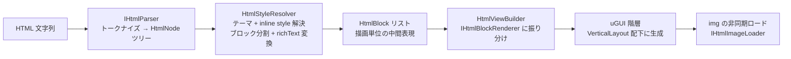
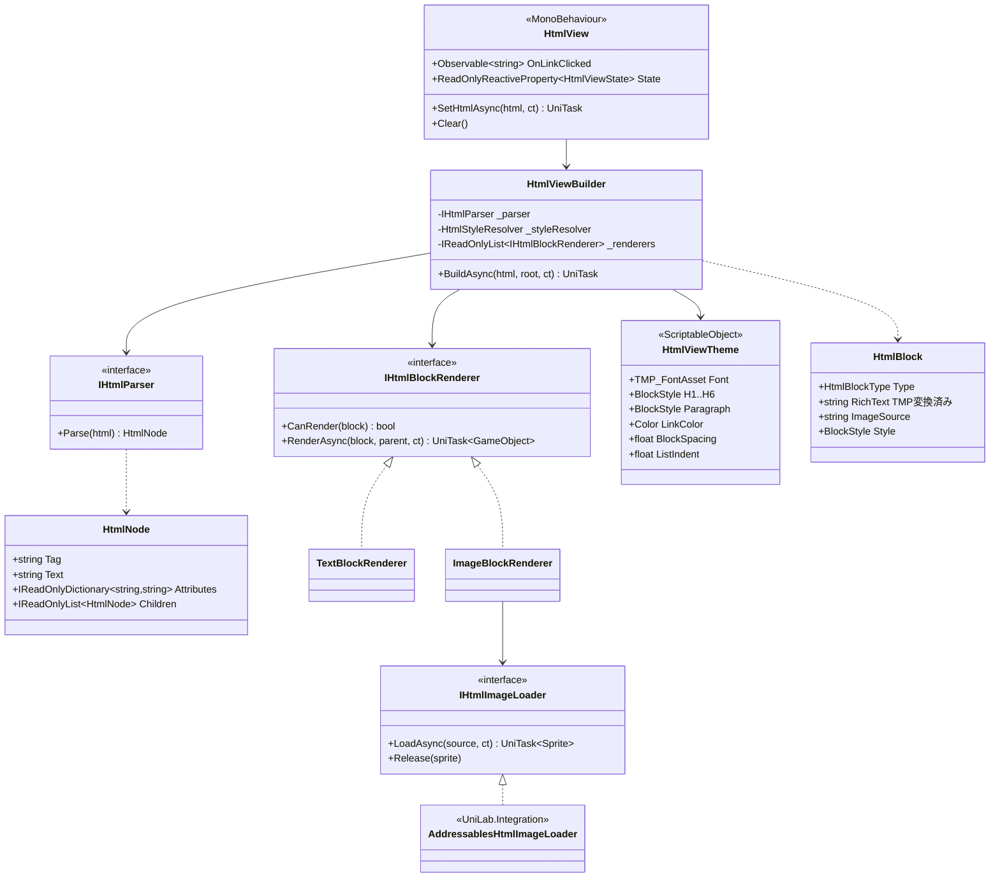

# UniLab.HtmlView 設計書（HTML → uGUI 描画システム）
作成日: 2026-06-13

> 全体方針（疎結合・asmdef 規約）は [design-unilab-foundation-overview.md](design-unilab-foundation-overview.md) に準拠。

---

## 概要

HTML 文字列を読み込み、uGUI（TextMeshPro + Image + RectTransform）として描画するシステム。

### 想定ユースケース

- お知らせ・ニュース（CMS / サーバ配信の HTML）
- ヘルプ・利用規約・特商法表記
- イベント告知（テキスト + 画像 + リンク）

### 採らない選択肢とその理由

| 選択肢 | 不採用理由 |
|---|---|
| プラットフォーム WebView | 見た目がゲーム UI と乖離する。uGUI と重ね順制御ができない。プラットフォーム依存が強い |
| フル HTML/CSS エンジン | スコープが爆発する。ブラウザを作るのが目的ではない |
| 全文 TMP リッチテキスト変換（1 TMP に全部） | 画像・リスト・区切り線が表現できない。長文で1メッシュが巨大化する |

### 設計の核

**ブロック要素 = GameObject、インライン要素 = TMP リッチテキスト**に写像する。

- `<p>`, `<h1>`〜`<h6>`, `<li>`, ``, `<hr>` 等のブロック要素 → 1つの uGUI GameObject（縦に積む）
- `<b>`, `<i>`, `<color>`, `<a>` 等のインライン要素 → ブロック内 TMP の richText タグ（`<b>`, `<i>`, `<color>`, `<link>`）に変換

uGUI のレイアウトエンジン（VerticalLayout + ContentSizeFitter）に縦方向の積み上げを任せ、横方向の折り返しは TMP に任せる。自前レイアウトエンジンを書かないことで実装量を1桁落とす。

---

## 対応タグ（v1 サブセット）

**HTML はアプリ側の管理下にある前提**（CMS から配信する自前コンテンツ）。任意の Web ページの描画は保証しない。

| 分類 | タグ | 写像先 |
|---|---|---|
| 見出し | `h1`〜`h6` | TMP ブロック（テーマのスタイル適用） |
| 段落 | `p`, `div` | TMP ブロック |
| 改行 | `br` | TMP richText `\n` |
| 強調 | `b`, `strong`, `i`, `em`, `u`, `s` | TMP richText `<b>` `<i>` `<u>` `<s>` |
| 色・サイズ | `span style="color/font-size"` | TMP richText `<color>` `<size>` |
| リンク | `a href` | TMP richText `<link>` + クリック通知 |
| 画像 | `img src width height` | Image ブロック（`IHtmlImageLoader` 経由で非同期ロード） |
| リスト | `ul`, `ol`, `li` | TMP ブロック（行頭に `•` / `1.` を付与、インデント） |
| 区切り線 | `hr` | Image ブロック（1px 線） |
| 引用 | `blockquote` | TMP ブロック（インデント + 左罫線） |

**v1 対象外**: `table`, `form` 系, 外部 CSS, `<video>`, 入れ子の複雑なレイアウト（float / flex）。v2 候補は末尾参照。

---

## 成果物

```
Assets/UniLab/HtmlView/
├── UniLab.HtmlView.asmdef        ← 参照: Logger, R3, UniTask, Unity.TextMeshPro
├── Interface/
│   ├── IHtmlParser.cs
│   ├── IHtmlImageLoader.cs
│   └── IHtmlBlockRenderer.cs
├── Model/
│   ├── HtmlNode.cs               ← パース結果の DOM（軽量・読み取り専用）
│   ├── HtmlBlock.cs              ← スタイル解決済みブロック（描画単位）
│   └── HtmlInlineStyle.cs
├── Parser/
│   ├── LightweightHtmlParser.cs  ← 自前トークナイザ（外部依存なし）
│   └── HtmlEntityDecoder.cs      ← &amp; &lt; 等のデコード
├── Style/
│   ├── HtmlViewTheme.cs          ← ScriptableObject（タグ → スタイルのマッピング）
│   └── HtmlStyleResolver.cs
├── Renderer/
│   ├── TextBlockRenderer.cs      ← TMP ブロック生成 + richText 変換
│   ├── ImageBlockRenderer.cs
│   └── HorizontalRuleRenderer.cs
├── HtmlView.cs                   ← MonoBehaviour（公開エントリポイント）
├── HtmlViewBuilder.cs            ← パイプライン統括（純粋 C#）
└── Loader/
    └── ResourcesHtmlImageLoader.cs ← デフォルト実装

Assets/UniLab/Integration/
└── AddressablesHtmlImageLoader.cs ← IAssetVaultService 経由の画像ロード
```

---

## パイプライン



パースとスタイル解決は**純粋 C#**（GameObject 非依存）。`HtmlBlock` リストまでは EditMode テスト可能にする。

---

## クラス図



> **言語バージョン制約**: 本プロジェクトは Unity 6000.5（**C# 9** まで）。`record` / `record struct` は C# 10 機能のため使用不可。値型は `readonly struct` で実装する（等価比較が必要な場合のみ `IEquatable<T>` を手実装）。

---

## 公開 API 設計

### HtmlView（エントリポイント）

```csharp
// 利用イメージ（アプリ層 Presenter）
await _newsView.HtmlView.SetHtmlAsync(newsHtml, cancellationToken);

_newsView.HtmlView.OnLinkClicked
    .Subscribe(url => OpenLink(url))
    .AddTo(_disposables);
```

| メンバー | 誰が呼ぶか / 何が起きるか |
|---|---|
| `SetHtmlAsync` | アプリ層 Presenter。パース → 描画 → 画像ロード完了まで await。再呼び出しで前の内容を `Clear()` してから再構築 |
| `OnLinkClicked` | `<a href>` のタップ通知。**URL を流すだけで遷移はしない**。ブラウザ起動 / アプリ内遷移（ディープリンク）の判断はアプリ層 |
| `State` | `Idle / Building / Ready / Failed`。ローディング表示の出し分けに購読 |
| `Clear` | 生成済みブロックの破棄と画像 `Release` |

### 疎結合ポイント

| 関心事 | 切り方 |
|---|---|
| 画像の入手経路 | `IHtmlImageLoader` 注入。Resources / StreamingAssets / Addressables / HTTP をアプリ層が選ぶ。Addressables 実装は `UniLab.Integration` |
| リンク遷移 | Observable で URL を流すだけ。HtmlView は遷移先を知らない |
| 見た目 | `HtmlViewTheme`（ScriptableObject）に集約。プロジェクトごとにテーマアセットを差し替え |
| 対応タグの拡張 | `IHtmlBlockRenderer` を追加実装して `HtmlViewBuilder` に登録（カスタムタグ `<button>` 等もアプリ層で足せる） |

---

## パーサ設計

**外部依存なしの自前トークナイザ**とする。

- AngleSharp 等のフル DOM パーサは IL2CPP ビルドサイズと AOT リスクに見合わない。HTML が自前管理である以上、寛容なエラー回復は不要
- 仕様: タグ開閉の対応ずれは**ベストエフォートで回復**（閉じ忘れは親ブロック終端で自動クローズ）。パース不能な断片はプレーンテキストとして描画し、例外で全体を落とさない
- `HtmlEntityDecoder` は `&amp; &lt; &gt; &quot; &#xxxx;` の数値参照まで対応
- `IHtmlParser` 抽象は維持するため、将来 AngleSharp が必要になれば NuGetForUnity 経由のアダプタ実装で差し替え可能

---

## セキュリティ / 健全性

HTML はサーバ配信＝**改竄・事故の可能性がある入力**として扱う。

- 対応タグ以外は**無視してテキストのみ抽出**（`<script>` 等は中身ごと破棄するタグとして denylist 管理）
- `<a href>` のスキームは `https` とアプリ定義のカスタムスキームのみ許可。`javascript:` 等は破棄
- `` の解釈は `IHtmlImageLoader` 実装に委ねるが、HTTP ローダー実装ではドメイン allowlist を持たせる
- 属性値の richText 変換時は TMP タグとして有効な値のみ通す（color は `#RRGGBB` 形式の検証）。**ユーザー入力由来のテキストを richText として流し込まない**（TMP タグインジェクション防止のためエスケープする）

---

## perf 方針

- 構築は `SetHtmlAsync` 時の1回のみ。**毎フレーム処理はゼロ**（uGUI のレイアウト再計算に任せる）
- // perf: トークナイザは `ReadOnlySpan<char>` ベースで走査し、文字列の中間アロケーションを抑える。richText 組み立てはブロック単位の `StringBuilder` 再利用
- TMP / Image の GameObject は**プール**する。お知らせ一覧のようにページ切り替えが頻発するユースケースで Instantiate/Destroy を繰り返さない
- 長文対策: ブロック単位で GameObject が分かれるため、1メッシュ巨大化は構造的に起きない。100 ブロックを超える場合は `ScrollRect` + 遅延構築（画面外ブロックの構築を `UniTask.Yield` で分割）を `BuildOptions` で選択可能にする
- 画像ロードは `UniTask.WhenAll` で並列。プレースホルダ（テーマ定義のサイズ）を先に置いてレイアウトを確定させ、ロード完了時の**リフロー（ガタつき）を防ぐ**。サイズ未指定の `img` はロード後にリフローを許容

---

## エラーハンドリング

| 事象 | 挙動 |
|---|---|
| パース不能な断片 | プレーンテキストとして描画（全体は落とさない） |
| 画像ロード失敗 | テーマ定義のエラープレースホルダ画像を表示。`State` は `Ready` のまま |
| キャンセル（画面遷移等） | 構築途中の GameObject を `Clear()` で破棄。try/finally で保証 |
| テーマ未設定 | `HtmlViewException`（実装バグ扱い） |

---

## テスト方針

- `LightweightHtmlParser`: HTML 断片 → `HtmlNode` ツリーの EditMode テスト（閉じ忘れ・エンティティ・不正タグの回復含む）
- `HtmlStyleResolver`: `HtmlNode` → `HtmlBlock`（richText 文字列）の EditMode テスト。**richText 変換はゴールデンテキスト比較**で網羅
- インジェクション: `&lt;color&gt;` 等を含む入力が TMP タグとして解釈されないことのテスト
- Renderer 層: PlayMode テスト（最小限。ブロック数と階層構造の検証のみ）

---

## v2 候補（v1 では作らない）

| 機能 | メモ |
|---|---|
| `table` | uGUI の GridLayout では colspan が表現できないため自前レイアウト計算が必要。需要が出てから |
| 外部 CSS（class 指定） | `HtmlViewTheme` に named style を足し `class` 属性で引く方式なら小さく入る。最有力 |
| インライン画像（絵文字的な `img`） | TMP の sprite asset 連携。事前登録制なら容易 |
| 動画 `<video>` | VideoPlayer + RenderTexture ブロック |
