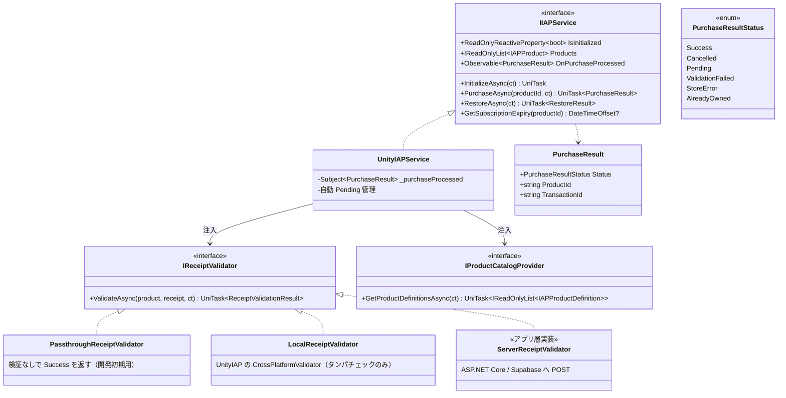
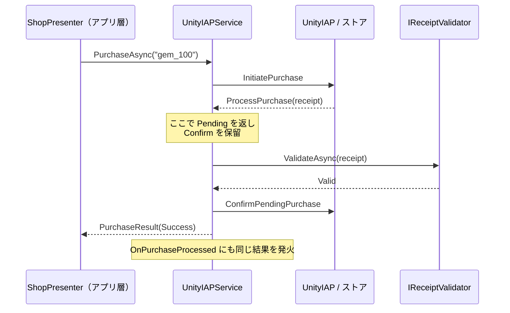

# UniLab.IAP 設計書（UnityIAP 課金基盤）
作成日: 2026-06-13

> 全体方針は [design-unilab-foundation-overview.md](design-unilab-foundation-overview.md) を参照。
> architecture.md の拡張予定（`IIAPService` / `UnityIAPService`）を具体化したもの。

---

## 概要

Unity IAP の生 API（コールバック地獄・ストアごとの差異）を隠蔽し、以下を提供する課金基盤。

- 購入フローの **async/await 化**（`PurchaseAsync` 1回の await で完結）
- **レシート検証の注入**（`IReceiptValidator`。サーバ検証 / ローカル検証 / 素通しを差し替え）
- **Pending トランザクション処理**（検証完了までストアに Confirm しない安全設計）
- リストア・サブスクリプション情報取得
- 商品カタログの注入（`IProductCatalogProvider`。マスタデータ由来でもハードコードでも可）

**UI を一切持たない。** 購入結果の表示・二重タップ防止・ローディングはアプリ層 Presenter の責務。

---

## 成果物

```
Assets/UniLab/IAP/
├── UniLab.IAP.asmdef
├── Interface/
│   ├── IIAPService.cs
│   ├── IReceiptValidator.cs
│   └── IProductCatalogProvider.cs
├── Model/
│   ├── IAPProductDefinition.cs
│   ├── IAPProduct.cs
│   ├── PurchaseResult.cs
│   ├── RestoreResult.cs
│   └── ReceiptValidationResult.cs
├── UnityIAPService.cs
└── Validator/
    ├── PassthroughReceiptValidator.cs
    └── LocalReceiptValidator.cs
```

サーバ検証実装（`ServerReceiptValidator`）は**アプリ層に置く**。エンドポイント仕様・認証方式がプロジェクト固有のため。

### モデルの責務分担

| 型 | 内容 | 出所 |
|---|---|---|
| `IAPProductDefinition` | `ProductId` + 商品種別（Consumable / NonConsumable / Subscription） | `IProductCatalogProvider` が供給する**入力定義**（マスタデータ由来等） |
| `IAPProduct` | 定義 + ストア取得情報（ローカライズ済み価格・表示名・購入可否） | UnityIAP 初期化後に `Products` で公開する**ランタイム情報** |

---

## クラス図



---

## 公開 API 設計

| メンバー | 誰が呼ぶか / 何が起きるか |
|---|---|
| `InitializeAsync` | BootSequence が起動時に呼ぶ。カタログ取得 → UnityIAP 初期化。失敗時は Exception。**冪等であり、失敗後の再呼び出し（ネットワーク復帰後のリトライ）を許容する** |
| `Products` | ショップ画面が価格・ローカライズ済み表示名の描画に使う |
| `PurchaseAsync` | ショップ Presenter が呼ぶ。購入 → レシート検証 → Confirm まで完了して結果を返す |
| `OnPurchaseProcessed` | **`PurchaseAsync` の戻り値で受け取れない購入**の通知。①起動時に回収された未完了トランザクション ②Ask to Buy（承認待ち→後日承認）③App Store プロモーション購入。アプリ層は起動直後から購読し、アイテム付与に繋げる |
| `RestoreAsync` | 設定画面の「購入を復元」ボタン（iOS 必須要件）。復元された購入も `OnPurchaseProcessed` 経由で流れる |
| `GetSubscriptionExpiry` | サブスク有効期限の表示・判定 |

### なぜ戻り値と Observable の二系統か

購入トランザクションは**アプリのライフサイクルを跨ぐ**（購入中クラッシュ・Ask to Buy・プロモ購入）。「呼び出しに対する応答」だけでは取りこぼすため、

- 同期的な購入フロー → `PurchaseAsync` の戻り値（UI が結果を直接 await できる）
- 非同期に届く購入 → `OnPurchaseProcessed`（付与処理はこちらに一本化してもよい）

の二系統とする。`PurchaseAsync` 成功時も `OnPurchaseProcessed` に**同じ結果を流す**。

**二重付与を防ぐため、付与処理は必ず `OnPurchaseProcessed` 側に一本化する。`PurchaseAsync` の戻り値は UI フィードバック（成功演出・エラー表示・ボタン制御）専用とする。** 戻り値側でも付与を書くと同一トランザクションを二度付与する。

なお `OnPurchaseProcessed` は内部 Subject から公開する Observable であり、**OnError を流さない**（OnNext のみ）。例外系はすべて `PurchaseAsync` / `InitializeAsync` の UniTask 側で投げる（R3 規約「ストリームを終了させない」準拠）。

---

## 購入フロー（Pending 方式）

検証が終わるまでストアに Confirm しない。**検証中にクラッシュしてもトランザクションがストア側に残り、次回起動時に再処理される**ことを保証する。



### 検証失敗時の扱い

| 検証結果 | 動作 |
|---|---|
| `Valid` | Confirm して `Success` |
| `Invalid`（改竄・不正レシート） | Confirm して `ValidationFailed`（再処理ループを防ぐため消化する） |
| `Unavailable`（検証サーバ到達不可） | **Confirm しない**。`Pending` を返し、次回起動時に再検証 |

---

## アイテム付与の責務境界

**UniLab.IAP は付与を行わない。** `OnPurchaseProcessed` を購読したアプリ層が、サーバ通信なりローカル保存なりで付与する。サーバ付与型（topia）の場合、付与 API 呼び出しを `IReceiptValidator.ValidateAsync` 内（検証＋付与を1リクエスト）に同居させる設計を推奨する。付与が終わるまで Confirm されないため、付与漏れが構造的に起きない。

---

## Unity IAP パッケージバージョン

本設計の公開 API は IAP 4.x（`IDetailedStoreListener`）/ 5.x（新 API）のどちらでも実装可能な抽象度にしてある。実装着手時に最新のサポート状況を確認して決定する（overview の未決事項参照）。バージョン差異は `UnityIAPService` 内部に閉じ、`IIAPService` には漏らさない。

---

## テスト方針

- `IIAPService` をモック化すればショップ Presenter は EditMode テスト可能
- `UnityIAPService` 自体は Fake Store（Unity IAP 標準）でエディタ動作確認
- `IReceiptValidator` の3実装はそれぞれ単体テスト（`LocalReceiptValidator` は既知の正規/改竄レシートのフィクスチャで検証）
