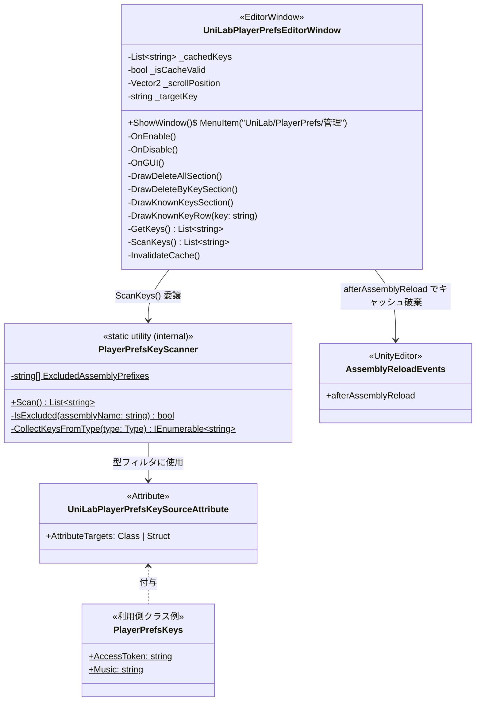
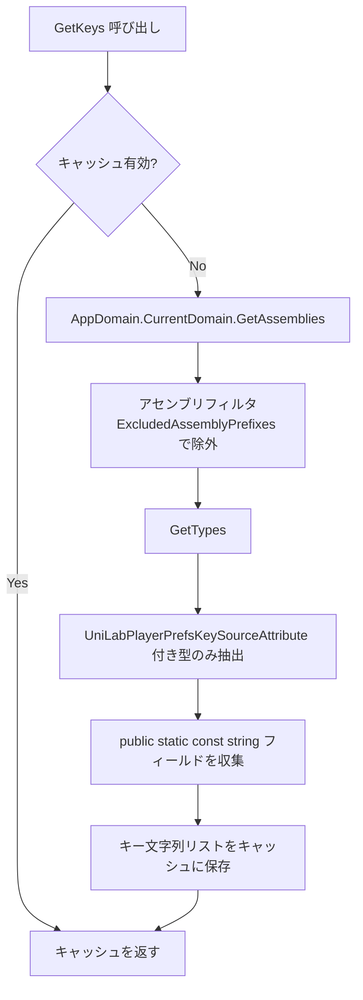

# UniLabPlayerPrefs 設計書

> aimy-mobile の `PlayerPrefsEditorWindow` を UniLab に移植する設計。
> Aimy という名称は一切使わない。

---

## 成果物

```
Assets/UniLab/Persistence/
├── UniLabUniLabPlayerPrefsKeySourceAttribute.cs ← NEW（アトリビュート定義）
└── Editor/
    └── UniLabPlayerPrefsEditorWindow.cs   ← 移植・リネーム（エディタウィンドウ）
```

既存ファイルへの変更なし。

---

## クラス図



---

## アセンブリフィルタ

スキャン対象から除外するプレフィックス：

| プレフィックス | 理由 |
|---|---|
| `UnityEngine` | Unity ランタイム本体 |
| `UnityEditor` | Unity エディタ本体 |
| `Unity.` | Unity パッケージ群 |
| `System` | .NET BCL |
| `mscorlib` | .NET BCL |
| `Mono.` | Mono ランタイム |
| `netstandard` | .NET Standard |

プロジェクトコード・UniLab・サードパーティパッケージのアセンブリのみスキャン対象。

---

## キースキャン処理フロー



---

## キャッシュ戦略

| タイミング | 動作 |
|---|---|
| ウィンドウ Open（`OnEnable`） | キャッシュ無効化 → 再スキャン |
| Refresh ボタン押下 | キャッシュ無効化 → 再スキャン |
| スクリプト再コンパイル後（`afterAssemblyReload`） | キャッシュ無効化（次回アクセス時に再スキャン） |
| それ以外の `OnGUI` 呼び出し | キャッシュをそのまま使用（スキャンなし） |

---

## UI 構成

```
┌─────────────────────────────────────────────┐
│  UniLab PlayerPrefs                          │
│  保存済みのPlayerPrefsを管理します           │
├─────────────────────────────────────────────┤
│  全削除                                      │
│  [ PlayerPrefs をすべて削除 ]               │
├─────────────────────────────────────────────┤
│  キー指定削除                                │
│  Key: [___________________________]          │
│  [ 入力した Key を削除 ]                    │
├─────────────────────────────────────────────┤
│  既知のキー                    [ 再読込 ]   │
│  ┌──────────────────────────────────────┐   │
│  │ ACCESS_TOKEN         保存済み [削除] │   │
│  │ REFRESH_TOKEN        未保存  [削除]  │   │
│  │ Music                保存済み [削除] │   │
│  │ ...                                  │   │
│  └──────────────────────────────────────┘   │
└─────────────────────────────────────────────┘
```

メニュー: `UniLab/PlayerPrefs/管理`

---

## 利用側の使い方

プロジェクト側でキー定数クラスに `[UniLabPlayerPrefsKeySource]` を付けるだけ。

```csharp
[UniLabPlayerPrefsKeySource]
public static class PlayerPrefsKeys
{
    public const string AccessToken  = "ACCESS_TOKEN";
    public const string Music        = "Music";
    public const string AimyVoice   = "AimyVoice";
}
```

- 複数クラスに分散してもよい（それぞれに attribute を付ける）
- asmdef 境界をまたいでも自動検出される
- 追加・削除はクラスを編集してスクリプトを再コンパイルするだけ

---

## 移植対象外

| ファイル | 理由 |
|---|---|
| `PlayerPrefsKeys.cs` | Aimy プロジェクト固有のキー定数。UniLab に持ち込む内容ではない |
| `PlayerPrefsLocaleStorage.cs` | Aimy 固有の `ILocaleStorage` に依存。UniLab に対応インターフェースなし |
