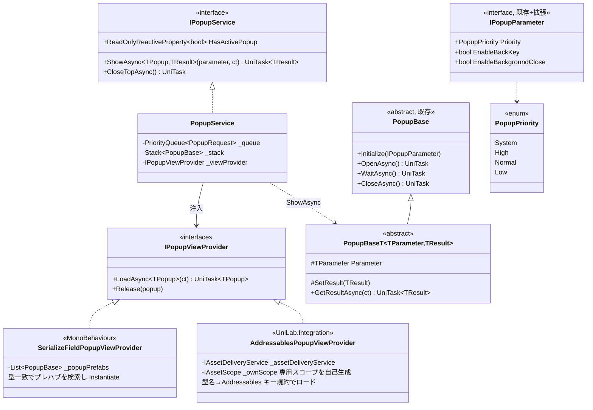
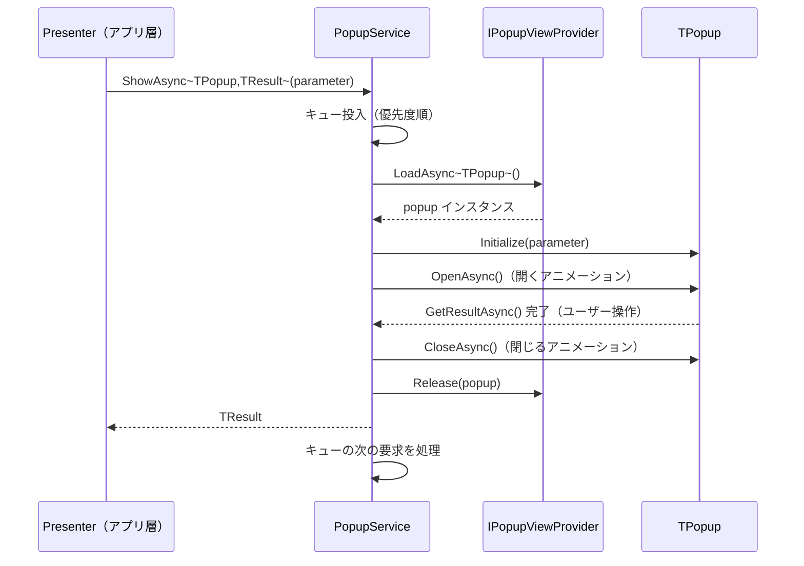

# UniLab Popup v2 設計書（ポップアップ基盤の汎用化）
作成日: 2026-06-13

> 全体方針は [design-unilab-foundation-overview.md](design-unilab-foundation-overview.md) を参照。
> architecture.md の「UniLabDialogManager（PopupManagerBase 改良）」を具体化したもの。

---

## 概要

既存の Popup 実装（`PopupManagerBase` / `PopupBase` / `UniLabPopupManager`）を、**任意のポップアップ型・任意の結果型・任意の View 供給元**に対応した汎用基盤に再設計する。

### 既存実装の課題

| 課題 | 現状 | v2 での解決 |
|---|---|---|
| ConfirmPopup 専用 | `UniLabPopupManager` が `ConfirmPopup` プレハブを SerializeField で直持ち | `ShowAsync<TPopup, TResult>` のジェネリック化 |
| 結果型が固定 | `PopupResult`（Confirm/Cancel）のみ | `PopupBase<TParameter, TResult>` で型自由化 |
| View 供給がプレハブ直参照 | SerializeField のみ。Addressables 配信に対応できない | `IPopupViewProvider` 注入 |
| Singleton 依存 | `SingletonMonoBehaviour` 経由のグローバルアクセス | `IPopupService` を VContainer 登録（Singleton は薄いファサードとして残置可） |
| 同時要求の制御なし | 呼んだ順に即スタック | 優先度付きキュー（System > High > Normal > Low） |

---

## 成果物

```
Assets/UniLab/UIComponent/Popup/
├── Interface/
│   ├── IPopupService.cs          ← NEW（v2 の中心 API）
│   ├── IPopupViewProvider.cs     ← NEW（View 供給の抽象化）
│   ├── IPopupManager.cs          ← 既存維持（Confirm 用の薄いラッパーに再実装）
│   └── IPopupParameter.cs        ← 既存維持（Priority を追加）
├── Base/
│   ├── PopupBase.cs              ← 既存維持
│   ├── PopupBaseT.cs             ← NEW（PopupBase<TParameter, TResult>）
│   └── PopupManagerBase.cs       ← 既存維持（内部実装として流用）
├── Provider/
│   └── SerializeFieldPopupViewProvider.cs ← NEW（プレハブ直登録版）
├── PopupService.cs               ← NEW（IPopupService 実装）
├── ConfirmPopup.cs               ← 既存維持
└── UniLabPopupManager.cs         ← 既存維持（後方互換。内部を PopupService 委譲に置換）

Assets/UniLab/Integration/
├── AddressablesPopupViewProvider.cs ← NEW（Addressables 未導入時は Integration ごと持ち込まない）
└── CompositePopupViewProvider.cs    ← NEW（SerializeField → Addressables フォールバック）
```

---

## クラス図



---

## 公開 API 設計

### IPopupService

```csharp
// 利用イメージ（アプリ層）
var reward = await _popupService.ShowAsync<RewardPopup, RewardPopupResult>(
    new RewardPopupParameter { Items = rewardItems },
    cancellationToken);
```

| メンバー | 誰が呼ぶか / 何が起きるか |
|---|---|
| `ShowAsync<TPopup, TResult>` | アプリ層 Presenter。View ロード → キュー投入 → 表示 → 結果 await → クローズ → Release まで一括 |
| `HasActivePopup` | 入力ブロック・Android バックキー処理の判定に購読 |
| `CloseTopAsync` | バックキー処理がトップのポップアップを閉じる |

### キューイングとスタックの関係

- **キュー**: 表示要求の待ち行列。表示中ポップアップがある状態で別要求が来たときの制御
- **スタック**: 表示中の重なり。ポップアップの上にポップアップを開く場合（既存挙動を維持）

| 状況 | 挙動 |
|---|---|
| 表示中なし → ShowAsync | 即表示 |
| ポップアップの処理中（結果 await の内側）から ShowAsync | スタックに積んで重ね表示（既存挙動） |
| 無関係なコンテキストから同時に ShowAsync | キューで直列化。優先度順 → 同優先度は FIFO |
| `Priority = System`（強制アップデート・メンテ通知等） | キュー先頭に割り込み |

### IPopupViewProvider — 疎結合の要

View の入手経路を抽象化する。**Popup 基盤は Addressables を知らない。**

| 実装 | 供給元 | 用途 |
|---|---|---|
| `SerializeFieldPopupViewProvider` | インスペクタ登録プレハブ | 小規模・組み込みポップアップ（Confirm 等） |
| `AddressablesPopupViewProvider` | `IAssetDeliveryService`（UniLab.AssetDelivery） | 配信アセット内のポップアップ。`UniLab.Integration` に配置 |
| `CompositePopupViewProvider` | 上記のフォールバックチェーン | SerializeField に無ければ Addressables を見る。`UniLab.Integration` に配置 |

Addressables キーは規約ベース（`Popup/{型名}.prefab`）とし、マッピングテーブルの手書きを不要にする。

#### AssetScope のライフタイム

`AddressablesPopupViewProvider` は Singleton（AppLifetimeScope）であり、SceneLifetimeScope に登録される Scoped な `IAssetScope` を**掴んではならない**（captive dependency になる）。代わりに `IAssetDeliveryService.CreateScope()` で**専用スコープを自己生成**し、`Release(popup)` 時に対応ハンドルを解放、自身の Dispose で専用スコープごと破棄する。

---

## 表示シーケンス



`ShowAsync` 全体は try/finally で囲み、**キャンセル・例外時も必ず `Release(popup)` を実行する**。ロード済み View のリークを構造的に防ぐ。

---

## 後方互換

- `IPopupManager.ShowAsync(PopupParameter)` は維持する。内部を `ShowAsync<ConfirmPopup, PopupResult>` への委譲に置き換え、既存の利用箇所（Sample 等）は無修正で動く
- `PopupBase` / `PopupManagerBase` の public シグネチャは変更しない
- `UniLabPopupManager`（Singleton）は残すが、新規コードでは `IPopupService` の DI を必須とする

---

## VContainer 登録

```csharp
// AppLifetimeScope（利用側）
// _popupViewProvider: DontDestroyOnLoad のルートプレハブ上の
// SerializeFieldPopupViewProvider を SerializeField で参照
builder.RegisterInstance(_popupViewProvider)
    .As<IPopupViewProvider>();
builder.Register<PopupService>(Lifetime.Singleton)
    .As<IPopupService>();
```

- architecture.md の規約どおり、**View（MonoBehaviour）は `RegisterInstance` でインターフェース登録**する。`RegisterComponentInHierarchy` は使わない
- ポップアップは全シーン共通 UI のため AppLifetimeScope 登録とする。AppLifetimeScope での `Lifetime.Singleton` は2階層構成における「アプリ全体で1つ」の表現であり規約と矛盾しない
- `_popupRoot`（Canvas）は DontDestroyOnLoad のルートプレハブに含める
