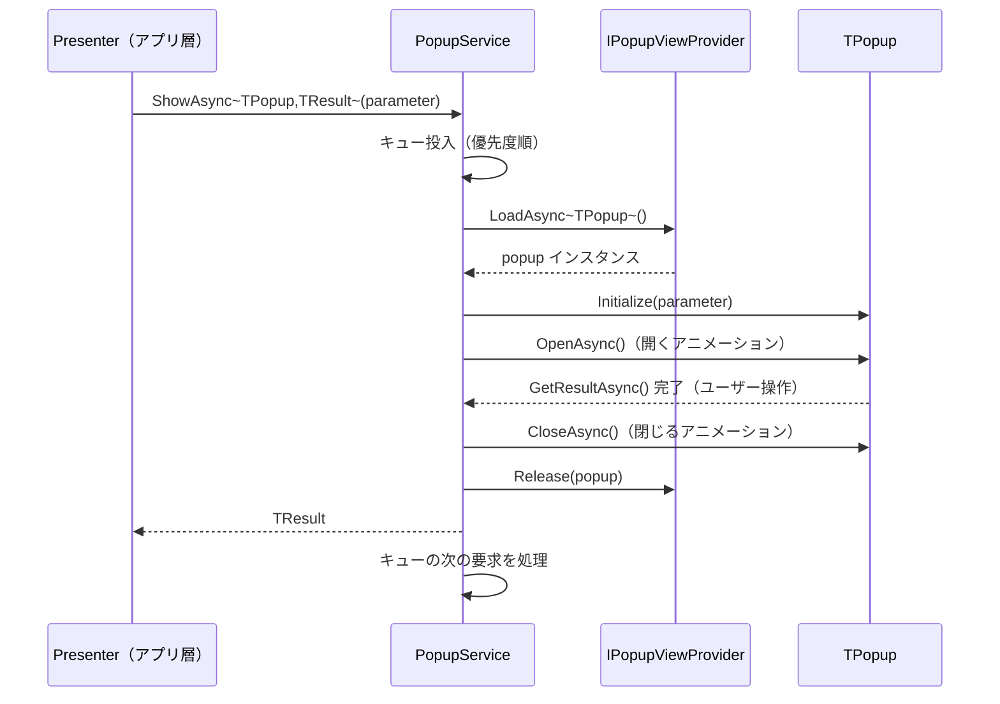

# UniLab Popup v2 設計書（ポップアップ基盤の汎用化）
作成日: 2026-06-13

> 全体方針は [design-unilab-foundation-overview.md](design-unilab-foundation-overview.md) を参照。
> architecture.md の「UniLabDialogManager（PopupManagerBase 改良）」を具体化したもの。

---

## 概要

既存の Popup 実装（`PopupManagerBase` / `PopupBase` / `UniLabPopupManager`）を、**任意のポップアップ型・任意の結果型・任意の View 供給元**に対応した汎用基盤に再設計する。

### 既存実装の課題

| 課題 | 現状 | v2 での解決 |
|---|---|---|
| ConfirmPopup 専用 | `UniLabPopupManager` が `ConfirmPopup` プレハブを SerializeField で直持ち | `ShowAsync<TPopup, TResult>` のジェネリック化 |
| 結果型が固定 | `PopupResult`（Confirm/Cancel）のみ | `PopupBase<TParameter, TResult>` で型自由化 |
| View 供給がプレハブ直参照 | SerializeField のみ。Addressables 配信に対応できない | `IPopupViewProvider` 注入 |
| Singleton 依存 | `SingletonMonoBehaviour` 経由のグローバルアクセス | `IPopupService` を VContainer 登録（Singleton は薄いファサードとして残置可） |
| 同時要求の制御なし | 呼んだ順に即スタック | 優先度付きキュー（System > High > Normal > Low） |

---

## 成果物

```
Assets/UniLab/UIComponent/Popup/
├── Interface/
│   ├── IPopupService.cs          ← NEW（v2 の中心 API）
│   ├── IPopupViewProvider.cs     ← NEW（View 供給の抽象化）
│   ├── IPopupManager.cs          ← 既存維持（Confirm 用の薄いラッパーに再実装）
│   └── IPopupParameter.cs        ← 既存維持（Priority を追加）
├── Base/
│   ├── PopupBase.cs              ← 既存維持
│   ├── PopupBaseT.cs             ← NEW（PopupBase<TParameter, TResult>）
│   └── PopupManagerBase.cs       ← 既存維持（内部実装として流用）
├── Provider/
│   └── SerializeFieldPopupViewProvider.cs ← NEW（プレハブ直登録版）
├── PopupService.cs               ← NEW（IPopupService 実装）
├── ConfirmPopup.cs               ← 既存維持
└── UniLabPopupManager.cs         ← 既存維持（後方互換。内部を PopupService 委譲に置換）

Assets/UniLab/Integration/
├── AddressablesPopupViewProvider.cs ← NEW（Addressables 未導入時は Integration ごと持ち込まない）
└── CompositePopupViewProvider.cs    ← NEW（SerializeField → Addressables フォールバック）
```

---

## クラス図


> **言語バージョン制約**: 本プロジェクトは Unity 6000.5（**C# 9** まで）。`record` / `record struct` は C# 10 機能のため使用不可。`PopupResult` などの値型は `readonly struct` で実装する（等価比較が必要な場合のみ `IEquatable<T>` を手実装）。

---

## 公開 API 設計

### IPopupService

```csharp
// 利用イメージ（アプリ層）
var reward = await _popupService.ShowAsync<RewardPopup, RewardPopupResult>(
    new RewardPopupParameter { Items = rewardItems },
    cancellationToken);
```

| メンバー | 誰が呼ぶか / 何が起きるか |
|---|---|
| `ShowAsync<TPopup, TResult>` | アプリ層 Presenter。View ロード → キュー投入 → 表示 → 結果 await → クローズ → Release まで一括 |
| `HasActivePopup` | 入力ブロック・Android バックキー処理の判定に購読 |
| `CloseTopAsync` | バックキー処理がトップのポップアップを閉じる |

### キューイングとスタックの関係

- **キュー**: 表示要求の待ち行列。表示中ポップアップがある状態で別要求が来たときの制御
- **スタック**: 表示中の重なり。ポップアップの上にポップアップを開く場合（既存挙動を維持）

| 状況 | 挙動 |
|---|---|
| 表示中なし → ShowAsync | 即表示 |
| ポップアップの処理中（結果 await の内側）から ShowAsync | スタックに積んで重ね表示（既存挙動） |
| 無関係なコンテキストから同時に ShowAsync | キューで直列化。優先度順 → 同優先度は FIFO |
| `Priority = System`（強制アップデート・メンテ通知等） | キュー先頭に割り込み |

### IPopupViewProvider — 疎結合の要

View の入手経路を抽象化する。**Popup 基盤は Addressables を知らない。**

| 実装 | 供給元 | 用途 |
|---|---|---|
| `SerializeFieldPopupViewProvider` | インスペクタ登録プレハブ | 小規模・組み込みポップアップ（Confirm 等） |
| `AddressablesPopupViewProvider` | `IAssetVaultService`（UniLab.AssetVault） | 配信アセット内のポップアップ。`UniLab.Integration` に配置 |
| `CompositePopupViewProvider` | 上記のフォールバックチェーン | SerializeField に無ければ Addressables を見る。`UniLab.Integration` に配置 |

Addressables キーは規約ベース（`Popup/{型名}.prefab`）とし、マッピングテーブルの手書きを不要にする。

#### AssetScope のライフタイム

`AddressablesPopupViewProvider` は Singleton（AppLifetimeScope）であり、SceneLifetimeScope に登録される Scoped な `IAssetScope` を**掴んではならない**（captive dependency になる）。代わりに `IAssetVaultService.CreateScope()` で**専用スコープを自己生成**し、`Release(popup)` 時に対応ハンドルを解放、自身の Dispose で専用スコープごと破棄する。

---

## 表示シーケンス



`ShowAsync` 全体は try/finally で囲み、**キャンセル・例外時も必ず `Release(popup)` を実行する**。ロード済み View のリークを構造的に防ぐ。

---

## 後方互換

- `IPopupManager.ShowAsync(PopupParameter)` は維持する。内部を `ShowAsync<ConfirmPopup, PopupResult>` への委譲に置き換え、既存の利用箇所（Sample 等）は無修正で動く
- `PopupBase` / `PopupManagerBase` の public シグネチャは変更しない
- `UniLabPopupManager`（Singleton）は残すが、新規コードでは `IPopupService` の DI を必須とする

---

## VContainer 登録

```csharp
// AppLifetimeScope（利用側）
// _popupViewProvider: DontDestroyOnLoad のルートプレハブ上の
// SerializeFieldPopupViewProvider を SerializeField で参照
builder.RegisterInstance(_popupViewProvider)
    .As<IPopupViewProvider>();
builder.Register<PopupService>(Lifetime.Singleton)
    .As<IPopupService>();
```

- architecture.md の規約どおり、**View（MonoBehaviour）は `RegisterInstance` でインターフェース登録**する。`RegisterComponentInHierarchy` は使わない
- ポップアップは全シーン共通 UI のため AppLifetimeScope 登録とする。AppLifetimeScope での `Lifetime.Singleton` は2階層構成における「アプリ全体で1つ」の表現であり規約と矛盾しない
- `_popupRoot`（Canvas）は DontDestroyOnLoad のルートプレハブに含める

---

## 実装追補（as-built / 2026-06-20）

> 本セクションが**実装の正**。上の設計から名称・構造が変わった箇所を以下に明記する（旧 `AddressablesPopupViewProvider` / `CompositePopupViewProvider` という命名は廃し、ロード手段を `IPopupAssetLoader` に分離した）。実装経緯は `docs/devlog/2026-06-20.md`。

### 開閉アニメーション（Transition）
- `IPopupTransition` / `PopupTransitionBase`（MonoBehaviour 基底）。`PopupBase._transition` に SerializeField で 1 つ差す。
- 実装: `ScalePopupTransition`（OutBack/InBack のスケール）、`FadePopupTransition`（CanvasGroup の alpha）、`CompositePopupTransition`（子 Transition を `UniTask.WhenAll` で同時再生。例: 中身スケール＋暗幕フェード）。
- 補間は DOTween 非依存の自前 `UIComponent/Tween/`（`unscaledDeltaTime`・CancellationToken 対応）。
- **入力ブロック**: `PopupBase._canvasGroup`（任意）。開閉アニメ中は `interactable=false`（`blocksRaycasts` は維持し背景貫通は遮断）。スケール対象は背景を含めないため、コンテンツ Panel を `_target` に指定する。

### 共通暗幕（Dimmer）
- `IPopupDimmer` / `PopupDimmer`（PopupRoot 直下に 1 枚）。各ポップアップは個別背景を持たず、`PopupService` が最前面の直下へ暗幕を移動する。`PopupBase._backgroundButton` は任意化（暗幕使用時は未配線）。
- 暗幕タップ購読は `PopupService` に 1 本集約し、**最前面のみ**を `Parameter.EnableBackgroundClose` 判定で閉じる（スタック時の二重発火回避）。

### スタック（オプトイン）
- `IPopupParameter.Stack` を追加。`Stack=true` は待機列を介さず**即時に最前面へ重ねる**。`Stack=false`（既定）は従来どおり優先度キューで 1 枚ずつ直列表示。
- `PopupService` は内部を `_stack`（List）で保持。`HasActivePopup` は `_stack.Count > 0`。
- ※上の「キューイングとスタックの関係」表は設計時の暗黙スタック想定。実装は **明示フラグによるオプトイン**に変更。

### 一括クローズ
- `IPopupService.CloseAllAsync()`: 表示中の全ポップアップを最前面から強制クローズ（`EnableBackKey` 非依存）し、スタックが空になるまで待つ。シーン遷移・ログアウト用。待機列の未表示要求は対象外。

### ロード手段の抽象化（IPopupAssetLoader）
View 入手を 2 段で分離する。`PopupService` は `IPopupViewProvider` のみに依存し、**コア（`UniLab.asmdef`）は Addressables/AssetVault を知らない。**

| 種別 | 型 | 置き場所 |
|---|---|---|
| ロード手段 IF | `IPopupAssetLoader`（`InstantiateAsync` / `Release`） | コア |
| 汎用 Provider | `PopupViewProvider`（ローダー＋PopupRoot を保持し委譲） | コア |
| Resources 実装 | `ResourcesPopupAssetLoader`（`Resources/Popup/{型名}`） | コア |
| AssetVault 実装 | `AssetVaultPopupAssetLoader`（per-popup `AssetScope`） | **別 asmdef** `UniLab.UIComponent.Popup.AssetVault` |
| 旧 | `SerializeFieldPopupViewProvider`（プレハブリスト方式） | コア・残置 |

- AssetVault 版は `IAssetVaultService.CreateScope()` → `scope.InstantiateAsync(address, parent, ct)` → `Release` で `scope.Dispose()`。インスタンス↔scope は `ConditionalWeakTable`（Unity の `==` 上書きに非依存）で対応づけ。アドレスは型名規約 `Popup/{型名}`。
- 切替はコンストラクタ差し替えのみ:
  ```csharp
  // Resources
  new PopupViewProvider(new ResourcesPopupAssetLoader(), popupRoot);
  // Addressables(AssetVault)
  new PopupViewProvider(new AssetVaultPopupAssetLoader(assetVaultService), popupRoot);
  ```

### DI（VContainer）
- `PopupInstaller`(IInstaller): `IPopupService` を Singleton 登録 ＋ `PopupBackKeyHandler`(IStartable) を EntryPoint 起動。`IPopupViewProvider`（および暗幕を使うなら `IPopupDimmer`）は利用側 LifetimeScope で登録する。
- バックキー: `PopupBackKeyHandler` が `BackKeyInputManager.OnPressBackKey`(R3) を購読し `CloseTopAsync` へ橋渡し（ESC ポーリングは `#if UNITY_ANDROID` 限定）。

### サンプル
- Resources 版: `Sample/Popup/`（Confirm / Reward / Priority / Sequence / Stack ボタン）。`PopupSampleBuilder` の「UniLab/Sample/Build Popup Sample」で再生成。
- AssetVault 版検証用: `Sample/Popup/AssetVault/PopupAssetVaultSampleEntry`（別 asmdef）。下記手順で動作確認する。

---

## AssetVault 経路の動作確認手順

`AssetVaultPopupAssetLoader` を実 Addressables で検証する手順（ローカル専用）。

1. **プレハブを Addressable 化**
   - `Assets/UniLab/Sample/Popup/Resources/Popup/ConfirmPopup.prefab` を選択し Inspector の「Addressable」をオン。
   - アドレスを `Popup/ConfirmPopup` に設定（型名規約。`ResourcesPopupAssetLoader` の `Resources/Popup/{型名}` と揃う）。
   - ※Resources フォルダ内アセットを Addressable 化すると警告が出る。検証目的では許容、または検証用にプレハブを Resources 外へ複製してアドレス付与でもよい。
2. **シーン配線**（既存 PopupSample シーンを流用可）
   - 空 GameObject に `PopupAssetVaultSampleEntry` を付与。
   - `_popupRoot`（Canvas 配下のフルスクリーン RectTransform）、`_dimmer`（PopupDimmer）、`_showButton`（任意のボタン）を割り当て。
3. **Play モード設定**
   - Addressables の Play Mode Script を「Use Asset Database (fastest)」にする（ローカル即時確認）。
4. **実行と確認**
   - Play → ボタン押下で ConfirmPopup が Addressables 経由でロード・表示されること。
   - 閉じたときに `AssetScope.Dispose()`（＝ `Addressables.Release`）が走り、**ハンドルがリークしないこと**を確認:
     - Profiler / Memory、または `AssetVaultCacheStats`（Debug）で参照が残らないこと。
     - 連続開閉してインスタンス数・ハンドル数が増え続けないこと。
   - OK なら「Resources / Addressables を差し替え可能な共通 Popup ライブラリ」完成。
